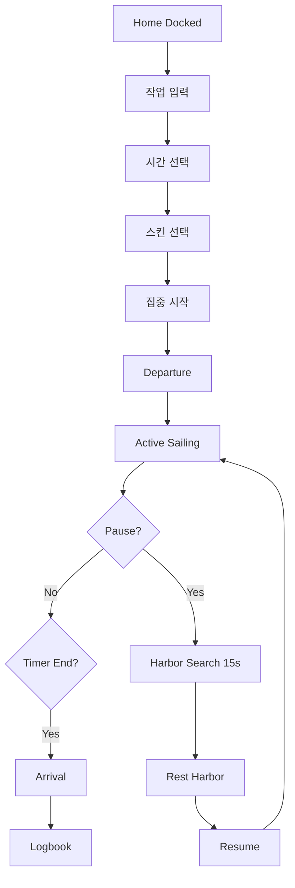
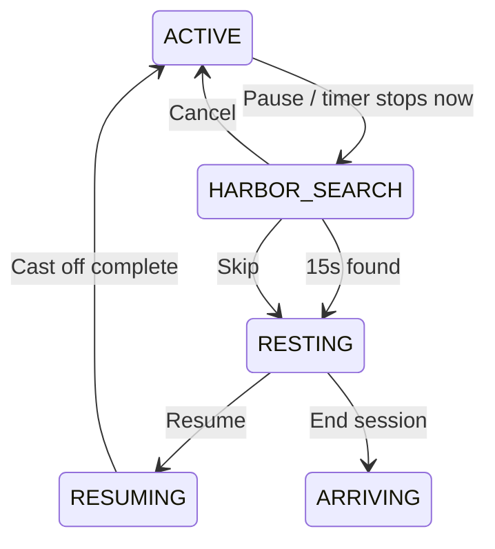
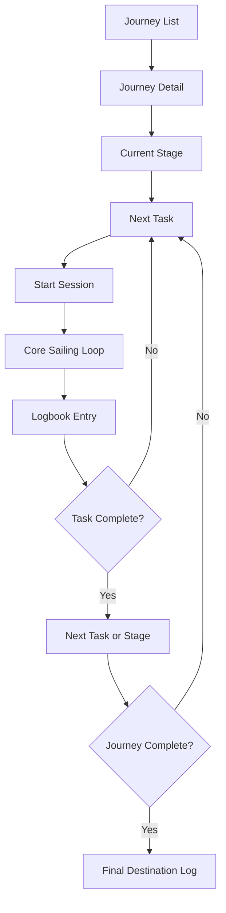
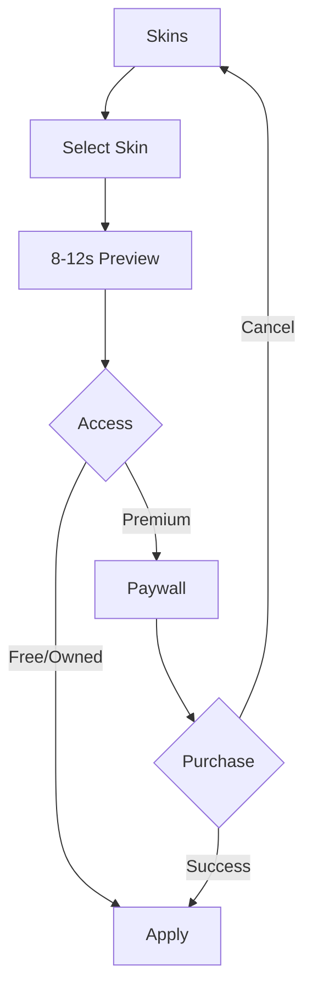

# FocusLoop UX Reboot Requirements v2.0 — Full Combined Edition

> 1인칭 정박·출항·항해·15초 항구 탐색·휴식·재출항·도착·항해일지·스킨 시스템 전체 요구사항

## 목차

- 00. Master Product Brief
- 01. Product Principles
- 02. Experience Architecture
- 03. First-Person Scene Specification
- 04. Session Lifecycle Requirements
- 05. 15-Second Harbor Search & Rest System
- 06. Skin System Requirements
- 07. Voyage Logbook System
- 08. Planning Modes
- 09. Information Architecture & Navigation
- 10. Screen UX Requirements
- 11. Motion & Comfort Requirements
- 12. Sound System Requirements
- 13. Visual & UI Design System
- 14. Retention & Progression
- 15. Monetization Requirements
- 16. Accessibility & Safety
- 17. Technical Architecture Requirements
- 18. Validation & Release Gates
- 19. Reboot Roadmap
- 20. Existing Project Reset Strategy
- Quick Focus Flow
- Pause, Rest, Resume Flow
- Long Journey Flow
- Skin Preview & Purchase Flow
- Acceptance Criteria Matrix
- Analytics Event Catalog
- API & Event Contract Requirements
- Audio Skin Profiles
- Data Model Specification
- Detailed Screen Requirements
- Error & Recovery Requirements
- Functional Requirements
- Motion Parameter Catalog
- Non-Functional Requirements
- Persistence, Offline & Sync Requirements
- QA Matrix
- Screen Catalog
- Skin Catalog
- State Transition Matrix
- User Stories & Acceptance Scenarios
- Copy Deck
- Decision Log Template
- Detailed QA Test Cases
- Glossary
- Implementation Checklist
- Risk Register
- User Research & Usability Test Plan
- Prompt 00 — Repository Audit
- Prompt 01 — New App Shell & State Machine
- Prompt 02 — First-Person Docked Home
- Prompt 03 — Departure & Active Sailing
- Prompt 04 — Pause Harbor Search
- Prompt 05 — Arrival & Logbook
- Prompt 06 — Skin System
- Prompt 07 — Planning Modes
- Prompt 08 — Validation
- Master Build Prompt — FocusLoop UX Reboot

---

# 00. Master Product Brief

## 1. Reboot 배경

기존 FocusLoop는 바다 배경, 배, 타이머, 홈 Composer까지 구현했지만 다음 한계가 남았다.

- 화면이 ‘바다 테마 타이머’에 머문다.
- 집중 시작과 종료 사이에 서사적 상태가 없다.
- 홈에서 배가 보이더라도 집중 시작 시 출항이라는 감각이 없다.
- 일시정지는 단순 Timer Pause다.
- 도착·정박·항해일지가 없다.
- 스킨 시스템이 없다.
- 현재 장면이 1인칭 몰입감을 주지 않는다.
- 다음 세션에 돌아올 정서적 이유가 약하다.

이 문제는 렌더링 파라미터를 조금 더 조정한다고 해결되지 않는다. 제품 UX와 상태 흐름을 다시 설계해야 한다.

## 2. 새 방향

### 시점

작은 배에 앉아 수평선을 바라보는 1인칭 시점.

### 세션 은유

```text
정박 중
→ 출항 준비
→ 출항
→ 항해
→ 주변 항구 탐색
→ 휴식 항구 정박
→ 재출항
→ 목적지 도착
→ 항해일지
```

### 제품의 차별점

- 집중 중 조작을 거의 요구하지 않는다.
- Pause를 실패가 아니라 ‘쉼터 찾기’로 재해석한다.
- 스킨마다 다른 항로와 항구를 제공한다.
- 완료 기록을 시각적 항해일지로 남긴다.
- 장기 목표는 여러 세션을 하나의 긴 여정으로 연결한다.

## 3. 목표 사용자

### 1차

- 개발·공부·글쓰기처럼 20~60분 몰입하는 사용자
- 일반 타이머가 지루하거나 압박감 있는 사용자
- Lo-fi, 환경음, 감성 배경을 켜두는 사용자
- 작업 중 화면을 보조 모니터나 태블릿에 띄우는 사용자

### 2차

- 장기 프로젝트를 단계별로 이어가고 싶은 사용자
- 휴식과 복귀를 자주 반복하는 사용자
- 생산성 점수와 스트릭 압박을 싫어하는 사용자

## 4. 핵심 성공 기준

- 첫 실행 후 10초 안에 세션 시작 가능
- 3초 안에 장면이 살아 있음을 인지
- 25분 사용 후 화면을 끄고 싶었다는 응답이 낮음
- Pause 후 Resume 비율이 높음
- 항해일지 확인 후 다음 세션 시작이 자연스러움
- 사용자가 스킨 차이를 ‘색만 다름’이 아니라 ‘다른 환경’으로 인식
- 7일 내 재사용 이유로 바다·항해·기록을 언급

## 5. 비목표

- 실시간 물리 항해
- 방향키 조작
- 자유 카메라
- 실제 지리 기반 항로
- MMO·소셜
- 항구 건설
- NPC 대화
- 재화 경제
- 미니게임
- 3D 오픈월드


---

# 01. Product Principles

## 1. 북극성

> 계속 보고 싶게 만들되, 계속 보게 만들면 안 된다.

## 2. 1인칭 시점의 이유

3인칭 배는 ‘화면 속 배를 본다’는 감각을 준다. 1인칭 시점은 사용자가 작은 배에 올라타 있다는 감각을 주며, 출항·항구 탐색·정박을 자연스럽게 연결한다.

그러나 1인칭은 잘못 구현하면 멀미와 집중 방해를 만든다. 따라서 자유 시점이 아니라 **고정된 좌석 시점의 2.5D Ambient Scene**으로 제한한다.

## 3. 제품 원칙

1. 빠른 집중은 가장 짧은 경로다.
2. 화면보다 작업이 우선이다.
3. 출항은 짧고 반복 가능해야 한다.
4. 집중 중 UI는 사라질 수 있어야 한다.
5. Pause는 즉시 적용된다.
6. 15초 항구 탐색은 선택 가능한 의식이다.
7. 휴식은 세션을 깨뜨리지 않는다.
8. 복귀는 같은 여정의 연속이다.
9. 도착은 조용하지만 분명해야 한다.
10. 기록은 점수가 아니라 흔적이다.
11. 스킨은 감각 묶음이다.
12. 유료화가 무료 집중을 방해하지 않는다.
13. 장면은 Web과 Native에서 같은 감정을 전달한다.
14. Reduce Motion에서도 제품 정체성이 유지된다.
15. 테스트 통과를 감각 품질 완료로 오인하지 않는다.

## 4. 감정 곡선

| 단계 | 감정 | 피해야 할 감정 |
|---|---|---|
| 홈 | 잠시 떠나고 싶다 | 설정이 많다 |
| 작업 입력 | 하나만 정하면 된다 | 계획을 완성해야 한다 |
| 출항 | 이제 시작했다 | 컷신을 기다린다 |
| 항해 | 조용히 옆에 있다 | 계속 보게 된다 |
| Pause | 잠시 쉬어도 된다 | 실패했다 |
| 항구 탐색 | 쉴 곳을 찾는다 | 강제로 15초 기다린다 |
| 휴식 | 안전하게 머문다 | 세션이 끝났다 |
| 재출항 | 자연스럽게 복귀한다 | 다시 처음부터다 |
| 도착 | 한 구간을 지나왔다 | 알람만 울렸다 |
| 일지 | 시간이 남았다 | 점수가 낮다 |


---

# 02. Experience Architecture

## 1. 전체 구조

```text
Onboarding
→ Home / Docked
→ Task & Duration
→ Departure
→ Focus Sailing
→ Pause Requested
→ Harbor Search 15s
→ Rest Harbor
→ Resume Departure
→ Focus Sailing
→ Arrival
→ Logbook Entry
→ Home / Next Journey
```

## 2. 화면과 상태 분리

화면 전환과 세션 상태를 같은 값으로 처리하지 않는다.

### Session State

- READY
- DEPARTING
- ACTIVE
- HARBOR_SEARCH
- RESTING
- RESUMING
- ARRIVING
- COMPLETED
- ABORTED

### Screen

- ONBOARDING
- HOME
- FOCUS
- REST
- LOGBOOK
- JOURNEYS
- SKINS
- SETTINGS

## 3. 1인칭 Scene 상태

- DOCKED_VIEW
- CAST_OFF
- OPEN_WATER
- SEARCHING_HARBOR
- APPROACHING_HARBOR
- HARBOR_REST
- LEAVING_HARBOR
- APPROACHING_DESTINATION
- ARRIVED

## 4. 핵심 상태 전이

| 현재 | 이벤트 | 다음 | 타이머 |
|---|---|---|---|
| READY | START | DEPARTING | 즉시 시작 |
| DEPARTING | ANIMATION_END | ACTIVE | 계속 |
| ACTIVE | PAUSE | HARBOR_SEARCH | 즉시 정지 |
| HARBOR_SEARCH | FOUND | RESTING | 정지 |
| HARBOR_SEARCH | SKIP | RESTING | 정지 |
| RESTING | RESUME | RESUMING | 재개 준비 |
| RESUMING | ANIMATION_END | ACTIVE | 재개 |
| ACTIVE | TIMER_END | ARRIVING | 종료 |
| ACTIVE | COMPLETE_EARLY | ARRIVING | 종료 |
| ARRIVING | ANIMATION_END | COMPLETED | 종료 |
| COMPLETED | SAVE | LOGBOOK | 종료 |

## 5. 화면 철학

홈은 ‘정박 중’이다. 집중은 ‘항해 중’이다. 휴식은 ‘쉼터 항구’다. 종료는 ‘목적지 도착’이다. 항해일지는 결과 화면이 아니라 다음 여정으로 연결되는 기록 공간이다.


---

# 03. First-Person Scene Specification

## 1. 시점 정의

사용자는 작은 보트의 좌석에 앉아 정면 수평선을 바라본다. 캐릭터의 손이나 몸은 기본 표시하지 않는다.

### 화면 구성

- 상단 32~38%: 하늘
- 중단: 수평선과 먼 환경
- 하단 12~20%: 보트의 선수, 좌우 난간, 밧줄 일부
- 중앙: 수면과 빛의 경로
- UI: 수평선과 선수의 핵심 형태를 가리지 않음

## 2. 왜 선수 일부를 보여주는가

선수나 난간이 전혀 없으면 단순 바다 배경처럼 보인다. 하단에 보트 일부가 있으면 사용자는 자신이 배 위에 있다는 공간감을 즉시 이해한다.

## 3. 카메라 안정성

### 일반 모드

- Vertical Bob: 1.5~3.5px
- Roll: ±0.15~0.35도
- Horizontal Drift: 0~1.5px
- 주기: 8~18초
- 카메라 Zoom 없음
- 자유 시점 없음

### Reduce Motion

- Bob: 0~0.8px
- Roll: 0
- 수면 명암 변화만 유지
- 항구 탐색 시 카메라 이동 대신 빛·레이더 UI 사용

## 4. 2.5D 레이어

```text
Sky Gradient
Far Clouds
Horizon Haze
Far Landmarks
Far Water
Mid Water Fields
Near Water
Boat Bow / Gunwale
Rope / Anchor Detail
Contact Foam
UI
Tone Overlay
```

## 5. 구현 방식

권장:

- Web: Canvas 2D
- Native: Skia 우선, 미지원 시 SVG + Reanimated
- Original SVG/Path로 선수·난간 제작
- Procedural Water Field
- 스킨별 원본 Vector Component 사용 가능
- Stock Image, 무단 에셋, 3D 모델 의존 금지

## 6. 홈의 1인칭 정박 시점

홈에서도 사용자는 이미 배에 앉아 있다.

- 좌측 또는 우측에 짧은 부두 가장자리
- 하단 선수
- 밧줄이 부두 고리에 연결
- 물결은 매우 약함
- 멀리 개방된 바다
- Composer는 선수와 밧줄을 가리지 않음

## 7. 출항 시점

- 밧줄이 느슨해지고 시야 밖으로 사라짐
- 부두가 아주 천천히 옆으로 밀림
- 수면 흐름이 조금 증가
- 큰 카메라 이동 없음
- 2~4초

## 8. 집중 시점

- 부두 없음
- 열린 수평선
- 스킨별 먼 랜드마크
- 선수는 화면 하단에 안정적으로 존재
- UI 자동 숨김

## 9. 항구 탐색 시점

카메라가 실제로 360도 회전하지 않는다.

대신:

- 주변 밝기 약간 감소
- 얇은 Compass Arc
- 좌우 5~8% 범위의 느린 시야 이동 또는 Parallax
- 먼 불빛 후보 2~3개
- 15초 진행
- 최종 한 불빛이 선택되어 접근

## 10. 항구 휴식 시점

- 가까운 방파제 또는 부표
- 물결이 더 잔잔함
- 멀리 작은 항구 불빛
- 선수는 같은 위치
- 휴식 UI가 낮은 대비로 표시

## 11. 도착 시점

- 목적지 랜드마크가 수평선에서 조금 커짐
- 빛의 경로가 선수를 향함
- 배 움직임 감소
- 짧은 정박 소리
- 항해일지 Sheet 등장


---

# 04. Session Lifecycle Requirements

## 1. READY / 정박 중

### 사용자 행동

- 모드 선택
- 작업 선택 또는 입력
- 시간 선택
- 스킨 선택
- 집중 시작

### 장면

- 1인칭 정박
- 밧줄
- 약한 물결
- 선택한 스킨의 출발 항구

## 2. DEPARTING / 출항

### 지속

2~4초.

### 요구사항

- 타이머는 Start 입력과 동시에 시작
- 사용자는 연출 Skip 가능
- Composer가 내려가며 Scene이 확장
- 밧줄 해제
- 부두 Parallax
- Sound Fade In
- 최소 UI 표시
- 4~6초 후 UI Auto Hide

## 3. ACTIVE / 집중 항해

### 장면

- 열린 바다
- 선수
- 스킨별 빛·날씨·사운드
- Progress에 따른 장시간 변화

### UI

- 작업명
- 남은 시간 또는 경과시간
- Pause
- 탭 시 보조 제어
- 자동 숨김

## 4. HARBOR_SEARCH / 주변 항구 탐색

### 진입

사용자가 Pause를 누르는 즉시 Session Timer를 정지한다.

### 지속

기본 15초.

### 사용자 선택

- 탐색 계속
- 바로 쉬기
- Pause 취소하고 복귀

### 장면

- Compass Arc
- 먼 불빛
- 수면 속도 감소
- Sound가 Deep Swell 중심으로 변함
- 남은 탐색 시간 표시

## 5. RESTING / 휴식 항구

### 옵션

- 5분 휴식
- 10분 휴식
- 자유 휴식
- 즉시 재출항
- 세션 종료

### 장면

- 보호된 수면
- 작은 항구 불빛
- 느린 파문
- 스킨별 항구 사운드

## 6. RESUMING / 재출항

1.5~3초.

- 닻 또는 밧줄 해제
- 항구가 멀어짐
- Focus Timer 재개
- Sound 복귀
- UI 3초 유지 후 숨김

## 7. ARRIVING / 목적지 도착

### 진입

- Countdown 종료
- 사용자의 조기 완료
- Stopwatch 종료

### 지속

2~4초.

### 장면

- 목적지 불빛
- 수면 안정
- 선수의 미세한 전진
- Sound Fade Down
- 결과 UI 등장

## 8. COMPLETED / 기록

- 실제 집중시간
- 휴식시간
- Pause 횟수
- 작업 완료 여부
- 사용 스킨
- 출발지·휴식 항구·목적지
- 짧은 메모
- 다음 행동

## 9. ABORTED / 중단

중단도 기록 가능하다.

- 집중시간 보존
- ‘실패’ 표현 금지
- 항해일지에 ‘중간 정박’으로 남길 수 있음


---

# 05. 15-Second Harbor Search & Rest System

## 1. 목적

일시정지를 단순히 숫자를 멈추는 버튼이 아니라 ‘주변의 안전한 쉼터를 찾는 짧은 전환’으로 만든다.

## 2. 가장 중요한 규칙

> Pause 버튼을 누르는 즉시 집중 타이머는 정지한다.

15초 항구 탐색은 Timer 정지를 지연시키지 않는다. 긴급하게 멈추고 싶은 사용자를 강제로 기다리게 하지 않는다.

## 3. 탐색 Flow

```text
Pause Tap
→ Timer Pause
→ 0~2초: 항해 속도 완화
→ 2~12초: 불빛 후보 탐색
→ 12~15초: 가까운 항구 선택
→ Rest Harbor
```

## 4. UI

- `쉴 곳을 찾는 중`
- 15초 Countdown
- `바로 쉬기`
- `집중으로 돌아가기`

## 5. 탐색 표현

### 사용할 것

- 얇은 Compass
- 수평선 불빛
- 작은 방향 표시
- Sound Filtering
- Haze 변화
- 아주 작은 좌우 Parallax

### 사용하지 않을 것

- 360도 카메라 회전
- 지도를 열어 직접 선택
- 빠른 Zoom
- 실패 확률
- 에너지·재화
- 랜덤 보상

## 6. 항구 선택

스킨마다 2~4개의 쉼터 항구 Variant를 가진다.

예:

- 새벽 해안: 등대 아래 작은 부두
- 비 오는 바다: 방파제 안쪽
- 달빛 항해: 조용한 야간 정박지
- 안개 해역: 부표가 안내하는 은신처

## 7. 휴식 Timer

### 기본

5분.

### 선택

- 5분
- 10분
- 자유 휴식

### 동작

- Focus Timer 정지
- Rest Timer 별도
- Rest 종료 알림
- 자동 재출항 금지
- 사용자가 Resume 선택

## 8. 휴식 중 기능

- 사운드 조절
- 작업 메모
- 스트레칭 한 줄 안내 선택
- 종료
- 재출항

## 9. 반복 Pause

같은 세션에서 여러 항구를 찾을 수 있다. 그러나 매번 15초 연출이 피로할 수 있으므로 다음 설정을 제공한다.

- 항상 15초 탐색
- 첫 Pause만 탐색
- 바로 항구 정박
- Reduce Motion에서는 3초 Fade

## 10. 검증 질문

- Pause가 즉시 적용되었는가?
- 15초가 기다림이 아니라 전환처럼 느껴지는가?
- 사용자가 Skip을 쉽게 찾는가?
- 휴식 후 다시 시작하고 싶은가?
- 항구 탐색이 집중을 깨는 게임처럼 보이지 않는가?


---

# 06. Skin System Requirements

## 1. 정의

스킨은 배경색 변경이 아니다.

```text
Skin
=
시각 팔레트
+ 하늘
+ 수면 움직임
+ 선수·보트 내부
+ 출발 항구
+ 휴식 항구
+ 목적지
+ 사운드
+ 출항 연출
+ 도착 연출
```

## 2. 스킨 구조

```ts
type FocusSkin = {
  id: string;
  name: string;
  access: 'FREE' | 'PREMIUM' | 'UNLOCK';
  palette: SkinPalette;
  boatView: BoatViewSpec;
  water: WaterMotionSpec;
  sky: SkySpec;
  sound: SoundProfile;
  departure: DepartureSpec;
  pauseHarbors: HarborSpec[];
  arrival: ArrivalSpec;
  reduceMotion: ReduceMotionSpec;
};
```

## 3. 출시 스킨 제안

### A. 고요한 새벽 — 무료 기본

- 회청색
- 잔잔한 파도
- 작은 목재 선수
- 먼 등대
- 기본 Water Bed
- 출발: 조용한 부두
- 휴식: 작은 등대 부두
- 도착: 해가 조금 오른 해안

### B. 맑은 연안 — 무료

- 밝은 청록·회백색
- 조금 더 선명한 수면
- 갈매기 0~1회
- 출발: 햇빛 있는 선착장
- 휴식: 부표가 있는 작은 만
- 도착: 따뜻한 해안 마을 불빛

### C. 비 오는 방파제 — Premium

- 흐린 청회색
- 빗방울 파문
- 낮은 천둥 없음
- 출발: 젖은 부두
- 휴식: 방파제 안쪽
- 도착: 비 속의 따뜻한 창

### D. 달빛 항해 — Premium

- 남청색
- 달빛 반사
- 별 1~5개
- 느린 파도
- 출발: 야간 부두
- 휴식: 등대 아래
- 도착: 항구 불빛

### E. 안개 해역 — Unlock

- 낮은 대비
- 안개
- 부표 안내음
- 랜드마크가 천천히 드러남
- 긴 여정 완료로 해금

## 4. 스킨 Preview

- 8~12초
- 정박 상태
- 출항 2초
- 집중 장면 5초
- 항구 2초
- Sound Preview
- 집중 시작 없이도 Preview 가능

## 5. 스킨 선택 시점

- Home
- Settings
- Session 시작 전

집중 중 즉시 스킨 변경은 기본 금지. 변경은 다음 출항부터 적용한다.

## 6. 스킨 개인화

초기에는 다음만 허용한다.

- 전체 Sound Volume
- Motion 감소
- 선수 밝기
- UI 밝기

복잡한 색상 Editor는 제외한다.

## 7. 해금

- 기본 2개 무료
- Premium 2개
- 장기 여정 완료 해금 1개
- 이벤트 한정은 추후 검토

## 8. 품질 기준

- 색만 다르게 보이면 실패
- 선수·항구·사운드 차이를 인지해야 함
- 각 스킨도 25분 동안 편안해야 함
- Premium이 무료보다 화려한 것이 아니라 다른 분위기여야 함


---

# 07. Voyage Logbook System

## 1. 역할

항해일지는 사용자가 보낸 집중 시간을 기억하고 다음 여정으로 연결하는 핵심 리텐션 기능이다.

## 2. 자동 기록

세션 종료 시 자동 생성:

- 세션 ID
- 날짜
- 작업명
- 계획 시간
- 실제 집중시간
- 휴식시간
- Pause 횟수
- 작업 완료 여부
- 모드
- 연결된 Daily Task / Journey Task
- 사용 스킨
- 출발 항구
- 방문 휴식 항구
- 목적지
- 장면 Seed
- 사용자 메모
- 종료 유형

## 3. 기록 카드

- 그날의 하늘 팔레트
- 1인칭 선수 실루엣
- 목적지 불빛
- 작업명
- 집중시간
- 완료 여부

티켓·탑승권 형태를 복제하지 않는다. 작은 항해 노트 페이지처럼 표현한다.

## 4. 일간 일지

- 오늘 총 집중시간
- 세션 목록
- 작업별 시간
- 방문 항구
- 사용 스킨
- 메모

## 5. 주간 일지

- 날짜별 항해 길이
- 가장 오래 머문 작업
- Pause 후 복귀율
- 장기 여정 진척
- 가장 많이 사용한 스킨

생산성 등급은 제공하지 않는다.

## 6. 긴 여정 일지

```text
프로젝트
├─ 단계
│  ├─ 세션 기록
│  ├─ 완료 작업
│  └─ 누적 집중시간
└─ 다음 단계
```

## 7. 메모

세션 종료 후 선택 입력:

- 오늘 한 일
- 다음에 할 일
- 한 줄 감정

강제하지 않는다.

## 8. 이미지 저장

장면 전체 스크린샷이 아니라 Scene Parameter로 작은 Logbook Thumbnail을 재생성한다. 개인정보가 포함된 작업명은 공유 이미지에서 숨길 수 있다.

## 9. 재시작 CTA

- 같은 작업 이어가기
- 다음 작업 시작
- 긴 여정 열기
- 홈으로

## 10. 데이터 보존

- Local-first
- Cloud Sync 선택
- Export
- 삭제
- 계정 탈퇴 시 처리


---

# 08. Planning Modes

## 1. 빠른 집중

가장 중요한 기본 경로.

- 작업명 한 줄
- 시간
- 스킨
- 시작

## 2. 오늘의 계획

최대 3개의 주요 작업.

- 작업 추가
- 순서
- 예상시간
- 현재 시작할 작업
- 오늘 내 완료 여부

집중 중에는 전체 목록을 표시하지 않는다.

## 3. 긴 여정

장기 목표를 단계와 작업으로 나눈다.

```text
Journey
├─ Stage
│  ├─ Task
│  └─ Task
└─ Stage
```

## 4. 모드와 항해 경험

세 모드는 집중 장면을 바꾸지 않는다. 모두 같은 1인칭 항해 UX를 공유한다.

## 5. 긴 여정의 목적지

장기 여정은 여러 세션이 하나의 큰 항로로 누적되는 느낌을 준다. 실제 지도는 사용하지 않는다.

- 단계 완료: 새로운 목적지 도착
- 프로젝트 완료: 특별 항해일지
- 해금 스킨 가능

## 6. 빠른 작업 승격

같은 Quick Task를 여러 번 반복하면:

- 오늘의 계획에 추가
- 긴 여정으로 승격

사용자에게 제안하되 자동 생성하지 않는다.


---

# 09. Information Architecture & Navigation

## 1. 주요 탭

### Home

정박 상태, 작업 시작.

### Journeys

오늘의 계획과 긴 여정.

### Logbook

일간·주간·프로젝트 기록.

### Skins

환경 선택과 Preview.

Settings는 Header 또는 별도 화면.

## 2. Home 구조

```text
Header
First-Person Docked Scene
Compact Composer
- Mode
- Task
- Duration
- Skin
- Start
```

## 3. Focus 구조

```text
First-Person Scene
Task Title
Timer
Pause
Tap Overlay Controls
```

## 4. Rest 구조

```text
Harbor Scene
Rest Timer
Resume
End
Sound
```

## 5. Logbook 구조

```text
Today
Week
Journeys
Entry Detail
```

## 6. Skin 구조

```text
Current Skin
Preview
Free
Premium
Unlocked
```

## 7. 모바일 우선

- Bottom Navigation 3~4개
- Safe Area
- 320×568 지원
- Composer 핵심 CTA 항상 보임
- 목록만 Scroll

## 8. 데스크톱

- Scene을 넓게 유지
- Composer 최소 가독 크기
- 모바일 패널을 단순 확대하지 않음
- Sidebar는 옵션


---

# 10. Screen UX Requirements

## 1. Home / Docked

- 선수와 부두가 보임
- Composer가 장면을 가리지 않음
- 선택한 스킨이 반영
- 마지막 작업 이어가기 선택
- 시작 CTA 하나

## 2. Departure

- UI 축소
- 밧줄 해제
- 부두가 멀어짐
- Sound Fade In
- Skip 가능

## 3. Focus

- UI Auto Hide
- 1인칭 선수
- 타이머
- Pause
- Sound
- 완료
- 종료

## 4. Harbor Search

- Pause 즉시
- 15초
- Skip
- Resume 취소
- 불빛 후보

## 5. Rest Harbor

- 5/10/자유
- 재출항
- 종료
- 메모
- 조용한 장면

## 6. Arrival

- 도착 불빛
- 배 안정
- 결과
- 작업 완료 선택

## 7. Logbook Entry

- 작업
- 집중시간
- 휴식시간
- 스킨
- 항구
- 메모
- 이어가기

## 8. Skins

- Preview
- 상태
- 구매
- 적용
- Reduce Motion Preview


---

# 11. Motion & Comfort Requirements

## 1. 1인칭 멀미 방지

- 자유 카메라 없음
- 수평선 기울기 최소
- Roll ±0.35도 이하
- Zoom 없음
- 급격한 Acceleration 없음
- 흔들림 설정 가능
- Reduce Motion

## 2. 출항

2~4초, Ease Out.

## 3. 수면

- 큰 명암 흐름 10~20초
- 작은 하이라이트 5~12초
- 선수 Bob 8~16초
- 서로 다른 주기

## 4. 항구 탐색

- 360도 회전 금지
- Compass와 Parallax
- 후보 불빛
- 15초

## 5. 휴식

- 배 움직임 30~50%
- 파도 속도 감소
- 항구 불빛
- UI 안정

## 6. 도착

- 2~4초
- 움직임 감소
- 빛 강화
- Sheet 등장

## 7. 실제 검증

- 30fps 30초
- 25분 사용자 테스트
- Motion 민감 사용자
- 모바일 실기기


---

# 12. Sound System Requirements

## 1. 공통 레이어

- Deep Swell
- Water Bed
- Foam
- Wind
- Wood Creak
- Harbor Ambience
- Rain / Night Skin Layer

## 2. 상태별 믹스

| 상태 | Sound |
|---|---|
| Docked | 낮은 Water Bed, 부두 소리 |
| Departing | Fade In, 밧줄·물 접촉 |
| Active | Skin Mix |
| Harbor Search | High Filter 감소, Compass Tone 선택 |
| Rest | Harbor Ambience, 낮은 파도 |
| Resuming | Active Mix 복귀 |
| Arriving | Fade Down, 정박 소리 |
| Logbook | 거의 무음 |

## 3. 반복 방지

- 단일 짧은 Loop 금지
- 서로 다른 Layer 주기
- Seeded Event
- 10분 반복 검사

## 4. 사용자 제어

- 전체 On/Off
- Volume
- 물/비/바람 고급 Mixer는 Premium 후보
- System Audio Interrupt 대응

## 5. 접근성

- Sound 없이 상태 이해
- 갑작스러운 큰 소리 없음
- 종료 진동 선택


---

# 13. Visual & UI Design System

## 1. 스타일

- 성숙한 Editorial Illustration
- 낮은 채도
- 얇은 Line
- 넓은 여백
- 높은 대비 CTA 하나
- Glass 효과 제한
- 큰 Glow 금지

## 2. 1인칭 선수

- 하단 12~20%
- 어두운 목재
- 작은 밝은 Edge
- 스킨별 재질
- 디테일 과다 금지

## 3. UI Surface

- Home Composer: Dark translucent
- Focus UI: Surface 없음 또는 최소 Blur
- Rest Panel: 항구 장면을 가리지 않음
- Logbook: 종이 티켓이 아닌 노트 페이지

## 4. Typography

- 한국어 가독성 우선
- 9~11px 금지
- Timer 32~52px
- Touch Target 44px+
- Dynamic Type

## 5. Color

스킨이 배경을 결정한다. UI는 공통 Neutral Token을 사용한다.

## 6. Icon

- Anchor
- Pause
- Resume
- Logbook
- Skin
- Sound
- Exit

항공기·탑승권 연상 Icon 사용 금지.


---

# 14. Retention & Progression

## 1. 반복 사용 이유

- 같은 장면을 다시 켜고 싶은 감각
- 다른 스킨
- 항해일지
- 긴 여정 진행
- 방문한 휴식 항구
- 조용한 해금

## 2. 수집

- 방문 항구
- 사용 스킨
- 목적지
- 장기 여정 완료 표지
- 계절 팔레트

## 3. 금지

- 코인
- XP
- 스트릭 손실
- 에너지
- 리더보드
- 광고 보상
- 랜덤 상자

## 4. 알림

- 지난 작업 이어가기
- 휴식 종료
- 주간 항해일지
- 새로운 스킨 해금

불안 유발 알림 금지.

## 5. 장기 여정

여러 세션을 하나의 여행으로 묶지만 실제 길 찾기 게임으로 만들지 않는다.


---

# 15. Monetization Requirements

## 1. 무료

- 기본 스킨 2개
- 빠른 집중
- 오늘의 계획
- 긴 여정 1개
- 항구 탐색
- 휴식
- 기본 항해일지
- 접근성

## 2. Premium

- 스킨
- 고급 Sound Mixer
- 무제한 긴 여정
- 월간·연간 항해일지
- Cloud Sync
- Widget / StandBy
- Export

## 3. 상품

- Monthly
- Annual
- Lifetime 선택 검토
- Skin Pack

## 4. Paywall

좋은 시점:

- Premium Skin Preview 후
- 두 번째 긴 여정 생성
- 월간 일지
- Cloud Sync

나쁜 시점:

- 첫 출항 전
- Pause
- 휴식
- 도착 직전

## 5. 윤리

- 무료 타이머 제한 금지
- 기록 소멸 협박 금지
- 접근성 유료화 금지


---

# 16. Accessibility & Safety

## 1. Reduce Motion

- 카메라 Roll 제거
- 선수 Bob 최소
- 항구 탐색 3초 Fade 또는 즉시 정박
- 수면 명암 변화 유지
- 출항·도착 Skip

## 2. Sound

- 무음 사용 가능
- 종료 진동
- 자막·상태 문구

## 3. 시각

- Contrast
- Dynamic Type
- 색상 외 상태
- 밝기 조절
- 야간 UI

## 4. 조작

- 44px
- Screen Reader
- Keyboard Web
- Focus Visible
- Pause 즉시

## 5. 멀미 안전

- Camera Sway 설정
- 수평선 안정
- 큰 Parallax 금지
- 사용자 테스트


---

# 17. Technical Architecture Requirements

## 1. Reboot 원칙

새 상태 모델과 화면 구조를 먼저 구현한 뒤 기존 코드를 선별 재사용한다.

## 2. 모듈

```text
app/
domain/
  session/
  tasks/
  journeys/
  logbook/
  skins/
scene/
  renderer/
  firstPersonBoat/
  water/
  harbor/
  transitions/
audio/
ui/
storage/
analytics/
```

## 3. Session State Machine

Reducer 또는 명시적 State Machine.

```ts
type SessionStatus =
  | 'READY'
  | 'DEPARTING'
  | 'ACTIVE'
  | 'HARBOR_SEARCH'
  | 'RESTING'
  | 'RESUMING'
  | 'ARRIVING'
  | 'COMPLETED'
  | 'ABORTED';
```

## 4. Timer

- Focus Timer
- Rest Timer
- Wall Clock 보정
- Pause 즉시
- Background 복귀
- Countdown / Stopwatch

## 5. Scene Contract

```ts
type SceneProps = {
  sceneState: SceneState;
  progress: number;
  skin: FocusSkin;
  reduceMotion: boolean;
  seed: number;
  harborSearchProgress?: number;
};
```

## 6. Skin Registry

Config + Renderer Component.

## 7. Logbook Repository

Local-first, Sync Adapter.

## 8. Migration

기존 Timer·Storage·API Adapter는 테스트 후 재사용 가능. 기존 Scene과 Screen은 Legacy로 이동한다.

## 9. Legacy

```text
legacy/v1-ocean/
```

새 코드가 Legacy Scene을 Import하지 않도록 한다.


---

# 18. Validation & Release Gates

## Gate 0. Concept

- 1인칭 화면 Mock
- 정박·출항·항해·항구·도착 5개 Frame
- 사용자 5명 이해

## Gate 1. Static Scene

- 기본 스킨 정적 화면
- Mobile/Desktop
- 선수와 수평선
- UI 없음

## Gate 2. Motion

- 30fps
- 30초
- 멀미 없음
- 3초 Motion 인지

## Gate 3. Core Loop

- READY→DEPARTING→ACTIVE→ARRIVING→LOGBOOK
- Timer 정확성

## Gate 4. Pause

- Pause 즉시
- 15초 항구 탐색
- Skip
- Rest
- Resume

## Gate 5. Skin

- 3개 이상
- 색만 다른 것이 아님
- Sound와 항구 차이

## Gate 6. Logbook

- 자동 기록
- Daily/Weekly/Journey
- 이어가기

## Gate 7. Native

- iOS/Android
- FPS
- Battery
- Audio
- Background

## Gate 8. 25분 사용

- 편안함
- 집중 방해
- 재사용 의향

## 출시 Blocker

- Home CTA 잘림
- Pause 지연
- 멀미
- Timer 오차
- 빈 Scene
- Skin 차이 없음
- Logbook 유실
- Native 미검증


---

# 19. Reboot Roadmap

## Phase 0 — 폐기·재사용 판단

- 기존 코드 Audit
- Timer 재사용
- Storage 재사용
- Scene Legacy 이동
- UX State Machine 생성

## Phase 1 — 1인칭 정박 홈

- 선수
- 부두
- 밧줄
- Composer
- 기본 스킨

## Phase 2 — 출항과 항해

- Departure
- Active Scene
- UI Hide
- Sound

## Phase 3 — Pause와 항구

- Pause 즉시
- 15초 Search
- Rest
- Resume

## Phase 4 — 도착과 항해일지

- Arrival
- Record
- Logbook

## Phase 5 — 스킨

- Dawn
- Coast
- Rain
- Moonlight

## Phase 6 — Planning

- Quick
- Daily
- Journey

## Phase 7 — QA

- Web
- Native
- Accessibility
- 25분 사용자 테스트

## Phase 8 — Monetization

핵심 리텐션 검증 후.


---

# 20. Existing Project Reset Strategy

## 1. 권장 판단

UI·Scene·상태 흐름은 새로 시작한다. Timer·Storage·API Adapter는 테스트 기반으로 선택 재사용한다.

## 2. 재사용 후보

- Timer Clock
- Reducer의 시간 계산
- Background 보정
- API Client
- Local Storage
- 일부 Task Type

## 3. 폐기 또는 Legacy

- 기존 3인칭 Ocean Scene
- 현재 Home Layout
- 현재 Focus Screen State Flow
- 기존 Skin 없는 Palette 구조
- 현재 단일 완료 Record UI
- Three.js 실험

## 4. 새 Branch

```text
ux-reboot-v2
```

## 5. Migration 기준

기존 기능을 억지로 유지하기보다 새 State Machine과 Data Model에 맞지 않으면 Adapter를 작성한다.

## 6. 단계적 전환

1. 새 App Shell
2. 새 Home
3. 새 Session State
4. 새 Scene
5. 새 Pause
6. 새 Logbook
7. 데이터 Migration
8. Legacy 제거

## 7. 롤백

기존 v1은 별도 Tag로 보존한다.


---

# Quick Focus Flow




---

# Pause, Rest, Resume Flow




---

# Long Journey Flow




---

# Skin Preview & Purchase Flow




---

# Acceptance Criteria Matrix

| 영역 | 완료 기준 |
| --- | --- |
| Home | 320×568에서 작업·시간·스킨·시작이 보임 |
| Docked Scene | 선수와 밧줄이 보이고 정박 상태로 이해됨 |
| Departure | 2~4초, Skip 가능, Timer 즉시 시작 |
| Focus | UI 자동 숨김, 1인칭 시점, 3초 내 Motion 인지 |
| Pause | Tap 즉시 Focus Timer 정지 |
| Harbor Search | 15초, Skip, Resume 취소 가능 |
| Rest | 5/10/자유, Focus Timer 정지 |
| Resume | 재출항 후 같은 세션 계속 |
| Arrival | 도착 연출과 작업 완료 선택 |
| Logbook | 세션 자동 기록과 이어가기 |
| Skin | 최소 3개가 장면·Sound·항구에서 구분 |
| Reduce Motion | 회전 없이 모든 Flow 사용 |
| Native | iOS/Android 실기기 검증 |


---

# Analytics Event Catalog

| 이벤트 | 속성 |
| --- | --- |
| app_opened | source, platform |
| home_viewed | mode, skin_id |
| task_entered | length_bucket only |
| duration_selected | timer_mode, planned_seconds |
| skin_previewed | skin_id, duration |
| session_start_requested | mode, skin_id |
| departure_started | skin_id |
| departure_skipped | elapsed_ms |
| session_active | session_id |
| focus_ui_hidden | elapsed_seconds |
| focus_ui_revealed | source |
| pause_requested | focused_seconds |
| harbor_search_started | skin_id |
| harbor_search_skipped | elapsed_seconds |
| harbor_search_cancelled | elapsed_seconds |
| rest_started | harbor_id, rest_mode |
| rest_completed | rest_seconds |
| resume_requested | pause_index |
| session_arriving | reason |
| task_completion_selected | completed |
| logbook_saved | mode, skin_id |
| session_restarted_from_log | entry_age |
| skin_purchase_started | skin_id |
| skin_purchase_completed | skin_id, product_id |


---

# API & Event Contract Requirements

## 1. 원칙

UI는 서버 응답을 기다리느라 출항을 막지 않는다. 서버 기록은 시작·상태 변경·종료 이벤트를 비동기적으로 동기화할 수 있다.

## 2. Session Start

```json
{
  "clientSessionId": "uuid",
  "taskId": "optional",
  "taskTitle": "encrypted-or-private",
  "mode": "QUICK",
  "timerMode": "COUNTDOWN",
  "plannedSeconds": 1500,
  "skinId": "DAWN",
  "startedAt": "ISO-8601"
}
```

## 3. State Event

```json
{
  "eventId": "uuid",
  "sessionId": "uuid",
  "type": "PAUSED|REST_STARTED|RESUMED|ARRIVING",
  "clientAt": "ISO-8601",
  "focusedSeconds": 600,
  "restSeconds": 0,
  "metadata": {}
}
```

## 4. Completion

```json
{
  "sessionId": "uuid",
  "focusedSeconds": 1480,
  "restSeconds": 300,
  "pauseCount": 1,
  "taskCompleted": true,
  "visitedHarborIds": ["dawn-lighthouse"],
  "completedAt": "ISO-8601"
}
```

## 5. 멱등성

- clientSessionId
- eventId
- logbookEntryId

## 6. Retry

Exponential Backoff, Offline Queue, 사용자 집중 방해 금지.


---

# Audio Skin Profiles

| 스킨 | Active Mix | Departure | Rest Harbor | Arrival |
| --- | --- | --- | --- | --- |
| DAWN | Water 0.45, Swell 0.2, Foam 0.12 | 부두 목재 | 등대 주변 잔물결 | 짧은 정박 |
| COAST | Water 0.5, Swell 0.18, Foam 0.18 | 갈매기 0~1회 | 작은 만 | 해안 벨 |
| RAIN | Rain 0.5, Water 0.25, Foam 0.1 | 젖은 부두 | 방파제 빗소리 | 창가 빗소리 |
| MOON | Water 0.35, Swell 0.28, Wind 0.1 | 야간 밧줄 | 등대 저음 | 항구 불빛 |
| FOG | Water 0.3, Swell 0.25, Wind 0.12 | 부표음 | 부표 쉼터 | 안개 안내음 |


---

# Data Model Specification

## Session

```ts
type FocusSession = {
  id: string;
  taskId?: string;
  taskTitle: string;
  mode: 'QUICK' | 'DAILY' | 'JOURNEY';
  timerMode: 'COUNTDOWN' | 'STOPWATCH';
  plannedSeconds: number;
  focusedSeconds: number;
  restSeconds: number;
  pauseCount: number;
  status: SessionStatus;
  skinId: string;
  departureHarborId: string;
  visitedHarborIds: string[];
  arrivalId?: string;
  seed: number;
  startedAt: string;
  completedAt?: string;
  taskCompleted?: boolean;
  note?: string;
};
```

## Skin

```ts
type FocusSkin = {
  id: string;
  name: string;
  access: 'FREE' | 'PREMIUM' | 'UNLOCK';
  paletteId: string;
  boatViewId: string;
  soundProfileId: string;
  departureId: string;
  harborIds: string[];
  arrivalId: string;
};
```

## Journey

```ts
type Journey = {
  id: string;
  title: string;
  stages: JourneyStage[];
  activeTaskId?: string;
  accumulatedSeconds: number;
  completedAt?: string;
};
```

## LogbookEntry

```ts
type LogbookEntry = {
  id: string;
  sessionId: string;
  visualSnapshot: SceneSnapshot;
  title: string;
  focusedSeconds: number;
  restSeconds: number;
  taskCompleted: boolean;
  note?: string;
  createdAt: string;
};
```


---

# Detailed Screen Requirements

## 01 Onboarding Welcome

### 목적

제품의 정체성과 1인칭 항해 은유를 5초 안에 전달한다.

### 진입 조건

- 이전 상태와 사용자의 명시적 행동으로 진입한다.
- Deep Link 또는 앱 복구로 진입할 때 필요한 데이터가 없으면 안전한 상위 화면으로 이동한다.

### 핵심 요소

- FocusLoop 로고
- 1인칭 선수
- 넓은 수평선
- 시작 CTA

### 주요 행동

- 다음
- 건너뛰기

### 상태

- Default
- Loading
- Empty
- Error
- Offline
- Small Screen
- Large Text
- Reduce Motion
- Sound Off

### 반응형

- 320×568에서 핵심 CTA가 보인다.
- 390×844에서 장면과 UI가 겹치지 않는다.
- 태블릿에서 과도하게 빈 UI가 되지 않는다.
- 데스크톱에서 모바일 패널을 단순 축소하지 않는다.
- Landscape에서 선수와 수평선을 유지한다.

### 접근성

- Touch Target 44px 이상
- Screen Reader Label
- Focus Order 명확
- Dynamic Type
- 색상 외 상태 표현
- Motion을 줄여도 기능 손실 없음

### 오류 복구

- Scene 실패 시 Static Fallback
- Network 실패 시 Local
- 중복 입력 방지
- 재시도 또는 이전 화면

### 금지

- 긴 기능 목록
- 강제 계정 생성

### 완료 기준

1. 사용자가 설명 없이 다음 행동을 찾는다.
2. 핵심 정보와 장면이 충돌하지 않는다.
3. 상태 전이가 Timer와 일치한다.
4. 오류가 집중 기록을 유실시키지 않는다.
5. 실제 캡처와 동영상으로 검증한다.

## 02 Onboarding Pause

### 목적

Pause가 실패가 아니라 쉼터 항구 탐색임을 설명한다.

### 진입 조건

- 이전 상태와 사용자의 명시적 행동으로 진입한다.
- Deep Link 또는 앱 복구로 진입할 때 필요한 데이터가 없으면 안전한 상위 화면으로 이동한다.

### 핵심 요소

- Pause 예시
- 15초 항구 탐색
- 바로 쉬기

### 주요 행동

- 다음

### 상태

- Default
- Loading
- Empty
- Error
- Offline
- Small Screen
- Large Text
- Reduce Motion
- Sound Off

### 반응형

- 320×568에서 핵심 CTA가 보인다.
- 390×844에서 장면과 UI가 겹치지 않는다.
- 태블릿에서 과도하게 빈 UI가 되지 않는다.
- 데스크톱에서 모바일 패널을 단순 축소하지 않는다.
- Landscape에서 선수와 수평선을 유지한다.

### 접근성

- Touch Target 44px 이상
- Screen Reader Label
- Focus Order 명확
- Dynamic Type
- 색상 외 상태 표현
- Motion을 줄여도 기능 손실 없음

### 오류 복구

- Scene 실패 시 Static Fallback
- Network 실패 시 Local
- 중복 입력 방지
- 재시도 또는 이전 화면

### 금지

- 복잡한 튜토리얼

### 완료 기준

1. 사용자가 설명 없이 다음 행동을 찾는다.
2. 핵심 정보와 장면이 충돌하지 않는다.
3. 상태 전이가 Timer와 일치한다.
4. 오류가 집중 기록을 유실시키지 않는다.
5. 실제 캡처와 동영상으로 검증한다.

## 03 Home Docked Quick

### 목적

작업 하나를 가장 빨리 시작한다.

### 진입 조건

- 이전 상태와 사용자의 명시적 행동으로 진입한다.
- Deep Link 또는 앱 복구로 진입할 때 필요한 데이터가 없으면 안전한 상위 화면으로 이동한다.

### 핵심 요소

- 정박 Scene
- 작업 입력
- 시간
- 스킨
- 집중 시작

### 주요 행동

- 입력
- 시간 선택
- 시작

### 상태

- Default
- Loading
- Empty
- Error
- Offline
- Small Screen
- Large Text
- Reduce Motion
- Sound Off

### 반응형

- 320×568에서 핵심 CTA가 보인다.
- 390×844에서 장면과 UI가 겹치지 않는다.
- 태블릿에서 과도하게 빈 UI가 되지 않는다.
- 데스크톱에서 모바일 패널을 단순 축소하지 않는다.
- Landscape에서 선수와 수평선을 유지한다.

### 접근성

- Touch Target 44px 이상
- Screen Reader Label
- Focus Order 명확
- Dynamic Type
- 색상 외 상태 표현
- Motion을 줄여도 기능 손실 없음

### 오류 복구

- Scene 실패 시 Static Fallback
- Network 실패 시 Local
- 중복 입력 방지
- 재시도 또는 이전 화면

### 금지

- CTA 잘림
- 과도한 카드

### 완료 기준

1. 사용자가 설명 없이 다음 행동을 찾는다.
2. 핵심 정보와 장면이 충돌하지 않는다.
3. 상태 전이가 Timer와 일치한다.
4. 오류가 집중 기록을 유실시키지 않는다.
5. 실제 캡처와 동영상으로 검증한다.

## 04 Home Daily

### 목적

오늘 작업 중 하나를 선택한다.

### 진입 조건

- 이전 상태와 사용자의 명시적 행동으로 진입한다.
- Deep Link 또는 앱 복구로 진입할 때 필요한 데이터가 없으면 안전한 상위 화면으로 이동한다.

### 핵심 요소

- 최대 3개 작업
- 시간
- 스킨
- 시작

### 주요 행동

- 작업 선택
- 추가

### 상태

- Default
- Loading
- Empty
- Error
- Offline
- Small Screen
- Large Text
- Reduce Motion
- Sound Off

### 반응형

- 320×568에서 핵심 CTA가 보인다.
- 390×844에서 장면과 UI가 겹치지 않는다.
- 태블릿에서 과도하게 빈 UI가 되지 않는다.
- 데스크톱에서 모바일 패널을 단순 축소하지 않는다.
- Landscape에서 선수와 수평선을 유지한다.

### 접근성

- Touch Target 44px 이상
- Screen Reader Label
- Focus Order 명확
- Dynamic Type
- 색상 외 상태 표현
- Motion을 줄여도 기능 손실 없음

### 오류 복구

- Scene 실패 시 Static Fallback
- Network 실패 시 Local
- 중복 입력 방지
- 재시도 또는 이전 화면

### 금지

- 스크롤 과다

### 완료 기준

1. 사용자가 설명 없이 다음 행동을 찾는다.
2. 핵심 정보와 장면이 충돌하지 않는다.
3. 상태 전이가 Timer와 일치한다.
4. 오류가 집중 기록을 유실시키지 않는다.
5. 실제 캡처와 동영상으로 검증한다.

## 05 Home Journey

### 목적

긴 여정의 다음 작업을 시작한다.

### 진입 조건

- 이전 상태와 사용자의 명시적 행동으로 진입한다.
- Deep Link 또는 앱 복구로 진입할 때 필요한 데이터가 없으면 안전한 상위 화면으로 이동한다.

### 핵심 요소

- 프로젝트
- 현재 단계
- 다음 작업
- 시간

### 주요 행동

- 프로젝트 선택
- 시작

### 상태

- Default
- Loading
- Empty
- Error
- Offline
- Small Screen
- Large Text
- Reduce Motion
- Sound Off

### 반응형

- 320×568에서 핵심 CTA가 보인다.
- 390×844에서 장면과 UI가 겹치지 않는다.
- 태블릿에서 과도하게 빈 UI가 되지 않는다.
- 데스크톱에서 모바일 패널을 단순 축소하지 않는다.
- Landscape에서 선수와 수평선을 유지한다.

### 접근성

- Touch Target 44px 이상
- Screen Reader Label
- Focus Order 명확
- Dynamic Type
- 색상 외 상태 표현
- Motion을 줄여도 기능 손실 없음

### 오류 복구

- Scene 실패 시 Static Fallback
- Network 실패 시 Local
- 중복 입력 방지
- 재시도 또는 이전 화면

### 금지

- 간트차트

### 완료 기준

1. 사용자가 설명 없이 다음 행동을 찾는다.
2. 핵심 정보와 장면이 충돌하지 않는다.
3. 상태 전이가 Timer와 일치한다.
4. 오류가 집중 기록을 유실시키지 않는다.
5. 실제 캡처와 동영상으로 검증한다.

## 06 Skin Browser

### 목적

환경을 탐색한다.

### 진입 조건

- 이전 상태와 사용자의 명시적 행동으로 진입한다.
- Deep Link 또는 앱 복구로 진입할 때 필요한 데이터가 없으면 안전한 상위 화면으로 이동한다.

### 핵심 요소

- 현재 스킨
- 무료
- Premium
- 해금

### 주요 행동

- Preview
- 적용
- 구매

### 상태

- Default
- Loading
- Empty
- Error
- Offline
- Small Screen
- Large Text
- Reduce Motion
- Sound Off

### 반응형

- 320×568에서 핵심 CTA가 보인다.
- 390×844에서 장면과 UI가 겹치지 않는다.
- 태블릿에서 과도하게 빈 UI가 되지 않는다.
- 데스크톱에서 모바일 패널을 단순 축소하지 않는다.
- Landscape에서 선수와 수평선을 유지한다.

### 접근성

- Touch Target 44px 이상
- Screen Reader Label
- Focus Order 명확
- Dynamic Type
- 색상 외 상태 표현
- Motion을 줄여도 기능 손실 없음

### 오류 복구

- Scene 실패 시 Static Fallback
- Network 실패 시 Local
- 중복 입력 방지
- 재시도 또는 이전 화면

### 금지

- 색상칩만 나열

### 완료 기준

1. 사용자가 설명 없이 다음 행동을 찾는다.
2. 핵심 정보와 장면이 충돌하지 않는다.
3. 상태 전이가 Timer와 일치한다.
4. 오류가 집중 기록을 유실시키지 않는다.
5. 실제 캡처와 동영상으로 검증한다.

## 07 Skin Preview

### 목적

스킨의 전체 감각을 확인한다.

### 진입 조건

- 이전 상태와 사용자의 명시적 행동으로 진입한다.
- Deep Link 또는 앱 복구로 진입할 때 필요한 데이터가 없으면 안전한 상위 화면으로 이동한다.

### 핵심 요소

- 정박
- 출항
- 항해
- 항구
- Sound

### 주요 행동

- 적용
- 구매
- 닫기

### 상태

- Default
- Loading
- Empty
- Error
- Offline
- Small Screen
- Large Text
- Reduce Motion
- Sound Off

### 반응형

- 320×568에서 핵심 CTA가 보인다.
- 390×844에서 장면과 UI가 겹치지 않는다.
- 태블릿에서 과도하게 빈 UI가 되지 않는다.
- 데스크톱에서 모바일 패널을 단순 축소하지 않는다.
- Landscape에서 선수와 수평선을 유지한다.

### 접근성

- Touch Target 44px 이상
- Screen Reader Label
- Focus Order 명확
- Dynamic Type
- 색상 외 상태 표현
- Motion을 줄여도 기능 손실 없음

### 오류 복구

- Scene 실패 시 Static Fallback
- Network 실패 시 Local
- 중복 입력 방지
- 재시도 또는 이전 화면

### 금지

- 30초 이상 강제

### 완료 기준

1. 사용자가 설명 없이 다음 행동을 찾는다.
2. 핵심 정보와 장면이 충돌하지 않는다.
3. 상태 전이가 Timer와 일치한다.
4. 오류가 집중 기록을 유실시키지 않는다.
5. 실제 캡처와 동영상으로 검증한다.

## 08 Departure

### 목적

집중 시작의 감정 전환.

### 진입 조건

- 이전 상태와 사용자의 명시적 행동으로 진입한다.
- Deep Link 또는 앱 복구로 진입할 때 필요한 데이터가 없으면 안전한 상위 화면으로 이동한다.

### 핵심 요소

- 밧줄
- 부두
- 선수
- 작업명

### 주요 행동

- Skip

### 상태

- Default
- Loading
- Empty
- Error
- Offline
- Small Screen
- Large Text
- Reduce Motion
- Sound Off

### 반응형

- 320×568에서 핵심 CTA가 보인다.
- 390×844에서 장면과 UI가 겹치지 않는다.
- 태블릿에서 과도하게 빈 UI가 되지 않는다.
- 데스크톱에서 모바일 패널을 단순 축소하지 않는다.
- Landscape에서 선수와 수평선을 유지한다.

### 접근성

- Touch Target 44px 이상
- Screen Reader Label
- Focus Order 명확
- Dynamic Type
- 색상 외 상태 표현
- Motion을 줄여도 기능 손실 없음

### 오류 복구

- Scene 실패 시 Static Fallback
- Network 실패 시 Local
- 중복 입력 방지
- 재시도 또는 이전 화면

### 금지

- 긴 컷신

### 완료 기준

1. 사용자가 설명 없이 다음 행동을 찾는다.
2. 핵심 정보와 장면이 충돌하지 않는다.
3. 상태 전이가 Timer와 일치한다.
4. 오류가 집중 기록을 유실시키지 않는다.
5. 실제 캡처와 동영상으로 검증한다.

## 09 Focus Visible

### 목적

필요한 제어를 제공한다.

### 진입 조건

- 이전 상태와 사용자의 명시적 행동으로 진입한다.
- Deep Link 또는 앱 복구로 진입할 때 필요한 데이터가 없으면 안전한 상위 화면으로 이동한다.

### 핵심 요소

- 작업명
- Timer
- Pause
- Exit

### 주요 행동

- Pause
- 탭
- 완료

### 상태

- Default
- Loading
- Empty
- Error
- Offline
- Small Screen
- Large Text
- Reduce Motion
- Sound Off

### 반응형

- 320×568에서 핵심 CTA가 보인다.
- 390×844에서 장면과 UI가 겹치지 않는다.
- 태블릿에서 과도하게 빈 UI가 되지 않는다.
- 데스크톱에서 모바일 패널을 단순 축소하지 않는다.
- Landscape에서 선수와 수평선을 유지한다.

### 접근성

- Touch Target 44px 이상
- Screen Reader Label
- Focus Order 명확
- Dynamic Type
- 색상 외 상태 표현
- Motion을 줄여도 기능 손실 없음

### 오류 복구

- Scene 실패 시 Static Fallback
- Network 실패 시 Local
- 중복 입력 방지
- 재시도 또는 이전 화면

### 금지

- HUD

### 완료 기준

1. 사용자가 설명 없이 다음 행동을 찾는다.
2. 핵심 정보와 장면이 충돌하지 않는다.
3. 상태 전이가 Timer와 일치한다.
4. 오류가 집중 기록을 유실시키지 않는다.
5. 실제 캡처와 동영상으로 검증한다.

## 10 Focus Hidden

### 목적

장면만 남겨 Ambient 사용을 지원한다.

### 진입 조건

- 이전 상태와 사용자의 명시적 행동으로 진입한다.
- Deep Link 또는 앱 복구로 진입할 때 필요한 데이터가 없으면 안전한 상위 화면으로 이동한다.

### 핵심 요소

- 1인칭 Scene

### 주요 행동

- 탭

### 상태

- Default
- Loading
- Empty
- Error
- Offline
- Small Screen
- Large Text
- Reduce Motion
- Sound Off

### 반응형

- 320×568에서 핵심 CTA가 보인다.
- 390×844에서 장면과 UI가 겹치지 않는다.
- 태블릿에서 과도하게 빈 UI가 되지 않는다.
- 데스크톱에서 모바일 패널을 단순 축소하지 않는다.
- Landscape에서 선수와 수평선을 유지한다.

### 접근성

- Touch Target 44px 이상
- Screen Reader Label
- Focus Order 명확
- Dynamic Type
- 색상 외 상태 표현
- Motion을 줄여도 기능 손실 없음

### 오류 복구

- Scene 실패 시 Static Fallback
- Network 실패 시 Local
- 중복 입력 방지
- 재시도 또는 이전 화면

### 금지

- 보이지 않는 Exit

### 완료 기준

1. 사용자가 설명 없이 다음 행동을 찾는다.
2. 핵심 정보와 장면이 충돌하지 않는다.
3. 상태 전이가 Timer와 일치한다.
4. 오류가 집중 기록을 유실시키지 않는다.
5. 실제 캡처와 동영상으로 검증한다.

## 11 Harbor Search

### 목적

Pause 이후 쉴 곳을 찾는다.

### 진입 조건

- 이전 상태와 사용자의 명시적 행동으로 진입한다.
- Deep Link 또는 앱 복구로 진입할 때 필요한 데이터가 없으면 안전한 상위 화면으로 이동한다.

### 핵심 요소

- 15초
- Compass
- 불빛
- 바로 쉬기
- 돌아가기

### 주요 행동

- Skip
- Cancel

### 상태

- Default
- Loading
- Empty
- Error
- Offline
- Small Screen
- Large Text
- Reduce Motion
- Sound Off

### 반응형

- 320×568에서 핵심 CTA가 보인다.
- 390×844에서 장면과 UI가 겹치지 않는다.
- 태블릿에서 과도하게 빈 UI가 되지 않는다.
- 데스크톱에서 모바일 패널을 단순 축소하지 않는다.
- Landscape에서 선수와 수평선을 유지한다.

### 접근성

- Touch Target 44px 이상
- Screen Reader Label
- Focus Order 명확
- Dynamic Type
- 색상 외 상태 표현
- Motion을 줄여도 기능 손실 없음

### 오류 복구

- Scene 실패 시 Static Fallback
- Network 실패 시 Local
- 중복 입력 방지
- 재시도 또는 이전 화면

### 금지

- 360도 회전

### 완료 기준

1. 사용자가 설명 없이 다음 행동을 찾는다.
2. 핵심 정보와 장면이 충돌하지 않는다.
3. 상태 전이가 Timer와 일치한다.
4. 오류가 집중 기록을 유실시키지 않는다.
5. 실제 캡처와 동영상으로 검증한다.

## 12 Rest Harbor

### 목적

안전하게 휴식한다.

### 진입 조건

- 이전 상태와 사용자의 명시적 행동으로 진입한다.
- Deep Link 또는 앱 복구로 진입할 때 필요한 데이터가 없으면 안전한 상위 화면으로 이동한다.

### 핵심 요소

- Rest Timer
- Resume
- End
- Sound

### 주요 행동

- 5분
- 10분
- 자유
- 재출항

### 상태

- Default
- Loading
- Empty
- Error
- Offline
- Small Screen
- Large Text
- Reduce Motion
- Sound Off

### 반응형

- 320×568에서 핵심 CTA가 보인다.
- 390×844에서 장면과 UI가 겹치지 않는다.
- 태블릿에서 과도하게 빈 UI가 되지 않는다.
- 데스크톱에서 모바일 패널을 단순 축소하지 않는다.
- Landscape에서 선수와 수평선을 유지한다.

### 접근성

- Touch Target 44px 이상
- Screen Reader Label
- Focus Order 명확
- Dynamic Type
- 색상 외 상태 표현
- Motion을 줄여도 기능 손실 없음

### 오류 복구

- Scene 실패 시 Static Fallback
- Network 실패 시 Local
- 중복 입력 방지
- 재시도 또는 이전 화면

### 금지

- 자동 재출항

### 완료 기준

1. 사용자가 설명 없이 다음 행동을 찾는다.
2. 핵심 정보와 장면이 충돌하지 않는다.
3. 상태 전이가 Timer와 일치한다.
4. 오류가 집중 기록을 유실시키지 않는다.
5. 실제 캡처와 동영상으로 검증한다.

## 13 Resuming

### 목적

같은 여정으로 돌아간다.

### 진입 조건

- 이전 상태와 사용자의 명시적 행동으로 진입한다.
- Deep Link 또는 앱 복구로 진입할 때 필요한 데이터가 없으면 안전한 상위 화면으로 이동한다.

### 핵심 요소

- 항구 이탈
- 선수
- 작업명

### 주요 행동

- Skip

### 상태

- Default
- Loading
- Empty
- Error
- Offline
- Small Screen
- Large Text
- Reduce Motion
- Sound Off

### 반응형

- 320×568에서 핵심 CTA가 보인다.
- 390×844에서 장면과 UI가 겹치지 않는다.
- 태블릿에서 과도하게 빈 UI가 되지 않는다.
- 데스크톱에서 모바일 패널을 단순 축소하지 않는다.
- Landscape에서 선수와 수평선을 유지한다.

### 접근성

- Touch Target 44px 이상
- Screen Reader Label
- Focus Order 명확
- Dynamic Type
- 색상 외 상태 표현
- Motion을 줄여도 기능 손실 없음

### 오류 복구

- Scene 실패 시 Static Fallback
- Network 실패 시 Local
- 중복 입력 방지
- 재시도 또는 이전 화면

### 금지

- 새 세션 생성

### 완료 기준

1. 사용자가 설명 없이 다음 행동을 찾는다.
2. 핵심 정보와 장면이 충돌하지 않는다.
3. 상태 전이가 Timer와 일치한다.
4. 오류가 집중 기록을 유실시키지 않는다.
5. 실제 캡처와 동영상으로 검증한다.

## 14 Arrival

### 목적

세션 종료를 도착으로 표현한다.

### 진입 조건

- 이전 상태와 사용자의 명시적 행동으로 진입한다.
- Deep Link 또는 앱 복구로 진입할 때 필요한 데이터가 없으면 안전한 상위 화면으로 이동한다.

### 핵심 요소

- 목적지
- 배 안정
- 결과

### 주요 행동

- Skip

### 상태

- Default
- Loading
- Empty
- Error
- Offline
- Small Screen
- Large Text
- Reduce Motion
- Sound Off

### 반응형

- 320×568에서 핵심 CTA가 보인다.
- 390×844에서 장면과 UI가 겹치지 않는다.
- 태블릿에서 과도하게 빈 UI가 되지 않는다.
- 데스크톱에서 모바일 패널을 단순 축소하지 않는다.
- Landscape에서 선수와 수평선을 유지한다.

### 접근성

- Touch Target 44px 이상
- Screen Reader Label
- Focus Order 명확
- Dynamic Type
- 색상 외 상태 표현
- Motion을 줄여도 기능 손실 없음

### 오류 복구

- Scene 실패 시 Static Fallback
- Network 실패 시 Local
- 중복 입력 방지
- 재시도 또는 이전 화면

### 금지

- 폭죽

### 완료 기준

1. 사용자가 설명 없이 다음 행동을 찾는다.
2. 핵심 정보와 장면이 충돌하지 않는다.
3. 상태 전이가 Timer와 일치한다.
4. 오류가 집중 기록을 유실시키지 않는다.
5. 실제 캡처와 동영상으로 검증한다.

## 15 Completion Choice

### 목적

시간 종료와 작업 완료를 구분한다.

### 진입 조건

- 이전 상태와 사용자의 명시적 행동으로 진입한다.
- Deep Link 또는 앱 복구로 진입할 때 필요한 데이터가 없으면 안전한 상위 화면으로 이동한다.

### 핵심 요소

- 완료
- 이어가기
- 기록 종료

### 주요 행동

- 선택

### 상태

- Default
- Loading
- Empty
- Error
- Offline
- Small Screen
- Large Text
- Reduce Motion
- Sound Off

### 반응형

- 320×568에서 핵심 CTA가 보인다.
- 390×844에서 장면과 UI가 겹치지 않는다.
- 태블릿에서 과도하게 빈 UI가 되지 않는다.
- 데스크톱에서 모바일 패널을 단순 축소하지 않는다.
- Landscape에서 선수와 수평선을 유지한다.

### 접근성

- Touch Target 44px 이상
- Screen Reader Label
- Focus Order 명확
- Dynamic Type
- 색상 외 상태 표현
- Motion을 줄여도 기능 손실 없음

### 오류 복구

- Scene 실패 시 Static Fallback
- Network 실패 시 Local
- 중복 입력 방지
- 재시도 또는 이전 화면

### 금지

- 자동 완료

### 완료 기준

1. 사용자가 설명 없이 다음 행동을 찾는다.
2. 핵심 정보와 장면이 충돌하지 않는다.
3. 상태 전이가 Timer와 일치한다.
4. 오류가 집중 기록을 유실시키지 않는다.
5. 실제 캡처와 동영상으로 검증한다.

## 16 Logbook Entry

### 목적

한 세션을 기록한다.

### 진입 조건

- 이전 상태와 사용자의 명시적 행동으로 진입한다.
- Deep Link 또는 앱 복구로 진입할 때 필요한 데이터가 없으면 안전한 상위 화면으로 이동한다.

### 핵심 요소

- 작업
- 시간
- 휴식
- 스킨
- 항구
- 메모

### 주요 행동

- 저장
- 이어가기

### 상태

- Default
- Loading
- Empty
- Error
- Offline
- Small Screen
- Large Text
- Reduce Motion
- Sound Off

### 반응형

- 320×568에서 핵심 CTA가 보인다.
- 390×844에서 장면과 UI가 겹치지 않는다.
- 태블릿에서 과도하게 빈 UI가 되지 않는다.
- 데스크톱에서 모바일 패널을 단순 축소하지 않는다.
- Landscape에서 선수와 수평선을 유지한다.

### 접근성

- Touch Target 44px 이상
- Screen Reader Label
- Focus Order 명확
- Dynamic Type
- 색상 외 상태 표현
- Motion을 줄여도 기능 손실 없음

### 오류 복구

- Scene 실패 시 Static Fallback
- Network 실패 시 Local
- 중복 입력 방지
- 재시도 또는 이전 화면

### 금지

- 점수

### 완료 기준

1. 사용자가 설명 없이 다음 행동을 찾는다.
2. 핵심 정보와 장면이 충돌하지 않는다.
3. 상태 전이가 Timer와 일치한다.
4. 오류가 집중 기록을 유실시키지 않는다.
5. 실제 캡처와 동영상으로 검증한다.

## 17 Daily Log

### 목적

오늘의 기록을 본다.

### 진입 조건

- 이전 상태와 사용자의 명시적 행동으로 진입한다.
- Deep Link 또는 앱 복구로 진입할 때 필요한 데이터가 없으면 안전한 상위 화면으로 이동한다.

### 핵심 요소

- 세션 목록
- 총시간
- 작업

### 주요 행동

- 열기
- 이어가기

### 상태

- Default
- Loading
- Empty
- Error
- Offline
- Small Screen
- Large Text
- Reduce Motion
- Sound Off

### 반응형

- 320×568에서 핵심 CTA가 보인다.
- 390×844에서 장면과 UI가 겹치지 않는다.
- 태블릿에서 과도하게 빈 UI가 되지 않는다.
- 데스크톱에서 모바일 패널을 단순 축소하지 않는다.
- Landscape에서 선수와 수평선을 유지한다.

### 접근성

- Touch Target 44px 이상
- Screen Reader Label
- Focus Order 명확
- Dynamic Type
- 색상 외 상태 표현
- Motion을 줄여도 기능 손실 없음

### 오류 복구

- Scene 실패 시 Static Fallback
- Network 실패 시 Local
- 중복 입력 방지
- 재시도 또는 이전 화면

### 금지

- 생산성 등급

### 완료 기준

1. 사용자가 설명 없이 다음 행동을 찾는다.
2. 핵심 정보와 장면이 충돌하지 않는다.
3. 상태 전이가 Timer와 일치한다.
4. 오류가 집중 기록을 유실시키지 않는다.
5. 실제 캡처와 동영상으로 검증한다.

## 18 Weekly Log

### 목적

주간 흐름을 본다.

### 진입 조건

- 이전 상태와 사용자의 명시적 행동으로 진입한다.
- Deep Link 또는 앱 복구로 진입할 때 필요한 데이터가 없으면 안전한 상위 화면으로 이동한다.

### 핵심 요소

- 날짜
- 집중시간
- 복귀율
- 스킨

### 주요 행동

- 필터

### 상태

- Default
- Loading
- Empty
- Error
- Offline
- Small Screen
- Large Text
- Reduce Motion
- Sound Off

### 반응형

- 320×568에서 핵심 CTA가 보인다.
- 390×844에서 장면과 UI가 겹치지 않는다.
- 태블릿에서 과도하게 빈 UI가 되지 않는다.
- 데스크톱에서 모바일 패널을 단순 축소하지 않는다.
- Landscape에서 선수와 수평선을 유지한다.

### 접근성

- Touch Target 44px 이상
- Screen Reader Label
- Focus Order 명확
- Dynamic Type
- 색상 외 상태 표현
- Motion을 줄여도 기능 손실 없음

### 오류 복구

- Scene 실패 시 Static Fallback
- Network 실패 시 Local
- 중복 입력 방지
- 재시도 또는 이전 화면

### 금지

- 경쟁

### 완료 기준

1. 사용자가 설명 없이 다음 행동을 찾는다.
2. 핵심 정보와 장면이 충돌하지 않는다.
3. 상태 전이가 Timer와 일치한다.
4. 오류가 집중 기록을 유실시키지 않는다.
5. 실제 캡처와 동영상으로 검증한다.

## 19 Journey List

### 목적

장기 목표를 관리한다.

### 진입 조건

- 이전 상태와 사용자의 명시적 행동으로 진입한다.
- Deep Link 또는 앱 복구로 진입할 때 필요한 데이터가 없으면 안전한 상위 화면으로 이동한다.

### 핵심 요소

- 진행 중
- 완료
- 추가

### 주요 행동

- 열기
- 생성

### 상태

- Default
- Loading
- Empty
- Error
- Offline
- Small Screen
- Large Text
- Reduce Motion
- Sound Off

### 반응형

- 320×568에서 핵심 CTA가 보인다.
- 390×844에서 장면과 UI가 겹치지 않는다.
- 태블릿에서 과도하게 빈 UI가 되지 않는다.
- 데스크톱에서 모바일 패널을 단순 축소하지 않는다.
- Landscape에서 선수와 수평선을 유지한다.

### 접근성

- Touch Target 44px 이상
- Screen Reader Label
- Focus Order 명확
- Dynamic Type
- 색상 외 상태 표현
- Motion을 줄여도 기능 손실 없음

### 오류 복구

- Scene 실패 시 Static Fallback
- Network 실패 시 Local
- 중복 입력 방지
- 재시도 또는 이전 화면

### 금지

- 게임 지도

### 완료 기준

1. 사용자가 설명 없이 다음 행동을 찾는다.
2. 핵심 정보와 장면이 충돌하지 않는다.
3. 상태 전이가 Timer와 일치한다.
4. 오류가 집중 기록을 유실시키지 않는다.
5. 실제 캡처와 동영상으로 검증한다.

## 20 Journey Detail

### 목적

현재 단계와 다음 작업을 본다.

### 진입 조건

- 이전 상태와 사용자의 명시적 행동으로 진입한다.
- Deep Link 또는 앱 복구로 진입할 때 필요한 데이터가 없으면 안전한 상위 화면으로 이동한다.

### 핵심 요소

- Stage
- Task
- 누적시간
- 일지

### 주요 행동

- 집중 시작
- 완료

### 상태

- Default
- Loading
- Empty
- Error
- Offline
- Small Screen
- Large Text
- Reduce Motion
- Sound Off

### 반응형

- 320×568에서 핵심 CTA가 보인다.
- 390×844에서 장면과 UI가 겹치지 않는다.
- 태블릿에서 과도하게 빈 UI가 되지 않는다.
- 데스크톱에서 모바일 패널을 단순 축소하지 않는다.
- Landscape에서 선수와 수평선을 유지한다.

### 접근성

- Touch Target 44px 이상
- Screen Reader Label
- Focus Order 명확
- Dynamic Type
- 색상 외 상태 표현
- Motion을 줄여도 기능 손실 없음

### 오류 복구

- Scene 실패 시 Static Fallback
- Network 실패 시 Local
- 중복 입력 방지
- 재시도 또는 이전 화면

### 금지

- 복잡한 PM 기능

### 완료 기준

1. 사용자가 설명 없이 다음 행동을 찾는다.
2. 핵심 정보와 장면이 충돌하지 않는다.
3. 상태 전이가 Timer와 일치한다.
4. 오류가 집중 기록을 유실시키지 않는다.
5. 실제 캡처와 동영상으로 검증한다.

## 21 Session Recovery

### 목적

중단된 세션을 복구한다.

### 진입 조건

- 이전 상태와 사용자의 명시적 행동으로 진입한다.
- Deep Link 또는 앱 복구로 진입할 때 필요한 데이터가 없으면 안전한 상위 화면으로 이동한다.

### 핵심 요소

- 이어가기
- 정박 종료
- 기록

### 주요 행동

- 선택

### 상태

- Default
- Loading
- Empty
- Error
- Offline
- Small Screen
- Large Text
- Reduce Motion
- Sound Off

### 반응형

- 320×568에서 핵심 CTA가 보인다.
- 390×844에서 장면과 UI가 겹치지 않는다.
- 태블릿에서 과도하게 빈 UI가 되지 않는다.
- 데스크톱에서 모바일 패널을 단순 축소하지 않는다.
- Landscape에서 선수와 수평선을 유지한다.

### 접근성

- Touch Target 44px 이상
- Screen Reader Label
- Focus Order 명확
- Dynamic Type
- 색상 외 상태 표현
- Motion을 줄여도 기능 손실 없음

### 오류 복구

- Scene 실패 시 Static Fallback
- Network 실패 시 Local
- 중복 입력 방지
- 재시도 또는 이전 화면

### 금지

- 데이터 유실

### 완료 기준

1. 사용자가 설명 없이 다음 행동을 찾는다.
2. 핵심 정보와 장면이 충돌하지 않는다.
3. 상태 전이가 Timer와 일치한다.
4. 오류가 집중 기록을 유실시키지 않는다.
5. 실제 캡처와 동영상으로 검증한다.

## 22 Settings

### 목적

환경과 접근성을 설정한다.

### 진입 조건

- 이전 상태와 사용자의 명시적 행동으로 진입한다.
- Deep Link 또는 앱 복구로 진입할 때 필요한 데이터가 없으면 안전한 상위 화면으로 이동한다.

### 핵심 요소

- Sound
- Motion
- Brightness
- Sync

### 주요 행동

- Toggle

### 상태

- Default
- Loading
- Empty
- Error
- Offline
- Small Screen
- Large Text
- Reduce Motion
- Sound Off

### 반응형

- 320×568에서 핵심 CTA가 보인다.
- 390×844에서 장면과 UI가 겹치지 않는다.
- 태블릿에서 과도하게 빈 UI가 되지 않는다.
- 데스크톱에서 모바일 패널을 단순 축소하지 않는다.
- Landscape에서 선수와 수평선을 유지한다.

### 접근성

- Touch Target 44px 이상
- Screen Reader Label
- Focus Order 명확
- Dynamic Type
- 색상 외 상태 표현
- Motion을 줄여도 기능 손실 없음

### 오류 복구

- Scene 실패 시 Static Fallback
- Network 실패 시 Local
- 중복 입력 방지
- 재시도 또는 이전 화면

### 금지

- 개발자 옵션

### 완료 기준

1. 사용자가 설명 없이 다음 행동을 찾는다.
2. 핵심 정보와 장면이 충돌하지 않는다.
3. 상태 전이가 Timer와 일치한다.
4. 오류가 집중 기록을 유실시키지 않는다.
5. 실제 캡처와 동영상으로 검증한다.


---

# Error & Recovery Requirements

| 오류 | 복구 | 보장 |
| --- | --- | --- |
| Scene Renderer Failure | Static Skin Poster를 코드로 렌더 | Timer 계속 |
| Audio Failure | 무음 상태 알림 | Timer 계속 |
| Network Failure | Local Mode | 나중에 Sync |
| Start API Failure | Local Session 시작 | Notice |
| Finish API Failure | Local Logbook 저장 | Retry Queue |
| App Crash | Snapshot 복구 | Recovery Screen |
| Harbor Search Animation Failure | 즉시 Rest Harbor | Timer 정지 유지 |
| Arrival Animation Failure | 즉시 Completion Choice | Logbook 생성 |
| Skin Missing | 기본 Dawn | 세션 계속 |
| Purchase Failure | 기존 스킨 유지 | 재시도 |


---

# Functional Requirements

## HOME

| ID | 요구사항 | 우선순위 |
| --- | --- | --- |
| HOME-001 | 홈은 1인칭 정박 장면을 기본으로 표시한다. | Must |
| HOME-002 | 하단 선수와 부두 또는 밧줄 중 하나가 보여 정박 상태를 이해할 수 있어야 한다. | Must |
| HOME-003 | 빠른 집중, 오늘의 계획, 긴 여정 모드를 전환할 수 있다. | Must |
| HOME-004 | 작업 입력, 시간 선택, 스킨 선택, 집중 시작 CTA가 320×568에서 모두 보여야 한다. | Must |
| HOME-005 | 키보드가 열려도 집중 시작 CTA가 접근 가능해야 한다. | Must |
| HOME-006 | 긴 목록만 별도 Scroll 영역을 사용한다. | Must |
| HOME-007 | 최근 작업 이어가기를 제공할 수 있다. | Should |
| HOME-008 | 선택한 스킨의 정박 항구와 사운드를 Preview한다. | Should |
| HOME-009 | 설정 오류나 API 실패가 집중 시작을 막지 않도록 Local Mode를 제공한다. | Must |
| HOME-010 | 집중 시작 중복 탭을 방지한다. | Must |

## DEPARTURE

| ID | 요구사항 | 우선순위 |
| --- | --- | --- |
| DEP-001 | 집중 시작 입력 즉시 Focus Timer를 시작한다. | Must |
| DEP-002 | 출항 연출은 기본 2~4초다. | Must |
| DEP-003 | 출항 연출을 Skip할 수 있다. | Must |
| DEP-004 | 밧줄 해제, 부두 Parallax, Sound Fade In을 포함한다. | Should |
| DEP-005 | Reduce Motion에서는 Fade 중심 0.5~1.5초로 축소한다. | Must |
| DEP-006 | 출항 중 앱이 Background로 가면 상태와 Timer를 복구한다. | Must |
| DEP-007 | 출항 중 Pause 입력을 허용하거나 명확히 비활성화한다. | Should |
| DEP-008 | 출항 애니메이션 실패 시 ACTIVE로 안전 전환한다. | Must |

## FOCUS

| ID | 요구사항 | 우선순위 |
| --- | --- | --- |
| FOCUS-001 | 집중 화면은 1인칭 선수와 열린 수평선을 표시한다. | Must |
| FOCUS-002 | 작업명, Timer, Pause만 기본 표시한다. | Must |
| FOCUS-003 | 4~6초 후 UI를 자동 숨긴다. | Must |
| FOCUS-004 | 화면 탭으로 UI를 재노출한다. | Must |
| FOCUS-005 | UI는 3~5초 후 다시 숨는다. | Should |
| FOCUS-006 | Countdown과 Stopwatch를 지원한다. | Must |
| FOCUS-007 | Timer 종료와 작업 완료를 분리한다. | Must |
| FOCUS-008 | Sound On/Off를 제공한다. | Must |
| FOCUS-009 | 세션 종료는 확인을 거친다. | Must |
| FOCUS-010 | Scene 렌더링 실패가 Timer를 중단시키지 않는다. | Must |
| FOCUS-011 | Progress에 따라 환경이 연속 변화한다. | Should |
| FOCUS-012 | 집중 중 스킨 즉시 변경은 기본 제공하지 않는다. | Should |

## PAUSE

| ID | 요구사항 | 우선순위 |
| --- | --- | --- |
| PAUSE-001 | Pause Tap 즉시 Focus Timer를 정지한다. | Must |
| PAUSE-002 | 15초 항구 탐색은 Timer 정지를 지연시키지 않는다. | Must |
| PAUSE-003 | 항구 탐색을 Skip할 수 있다. | Must |
| PAUSE-004 | 탐색을 취소하고 집중으로 돌아갈 수 있다. | Must |
| PAUSE-005 | 탐색 중 Compass Arc와 먼 불빛 후보를 표시한다. | Should |
| PAUSE-006 | 360도 Camera 회전을 사용하지 않는다. | Must |
| PAUSE-007 | 같은 세션의 반복 Pause 정책을 설정할 수 있다. | Could |
| PAUSE-008 | Reduce Motion에서는 즉시 또는 3초 이내 항구 전환한다. | Must |
| PAUSE-009 | 탐색 실패 개념과 실패 확률을 두지 않는다. | Must |
| PAUSE-010 | 항구 탐색 중 세션 종료가 가능하다. | Must |

## REST

| ID | 요구사항 | 우선순위 |
| --- | --- | --- |
| REST-001 | 5분, 10분, 자유 휴식을 제공한다. | Must |
| REST-002 | Focus Timer와 Rest Timer를 분리한다. | Must |
| REST-003 | Rest 종료 후 자동 재출항하지 않는다. | Must |
| REST-004 | 사용자가 Resume를 선택해야 한다. | Must |
| REST-005 | 휴식 중 Sound를 조절할 수 있다. | Should |
| REST-006 | 휴식 중 세션을 종료할 수 있다. | Must |
| REST-007 | 휴식 메모를 선택적으로 입력할 수 있다. | Could |
| REST-008 | 휴식 항구는 선택 스킨과 일치한다. | Must |
| REST-009 | Rest 상태에서 배와 파도의 움직임을 낮춘다. | Must |

## RESUME

| ID | 요구사항 | 우선순위 |
| --- | --- | --- |
| RES-001 | 재출항은 1.5~3초다. | Should |
| RES-002 | Focus Timer는 재출항 입력 시점 또는 연출 종료 시점 정책을 일관되게 적용한다. | Must |
| RES-003 | 권장 정책은 재출항 입력 즉시 Timer 재개다. | Should |
| RES-004 | 재출항 연출을 Skip할 수 있다. | Must |
| RES-005 | 항구 장면에서 열린 바다 장면으로 자연스럽게 전환한다. | Should |

## ARRIVAL

| ID | 요구사항 | 우선순위 |
| --- | --- | --- |
| ARR-001 | Countdown 종료, Stopwatch 종료, 조기 완료 시 ARRIVING 상태로 진입한다. | Must |
| ARR-002 | 도착 연출은 2~4초다. | Should |
| ARR-003 | 도착 연출 Skip을 제공한다. | Must |
| ARR-004 | 목적지 불빛과 수면 안정화를 표현한다. | Should |
| ARR-005 | 작업 완료 여부를 사용자에게 묻는다. | Must |
| ARR-006 | 완료하지 못해도 집중 기록을 저장한다. | Must |
| ARR-007 | 도착 연출 실패 시 Logbook 생성으로 안전 전환한다. | Must |

## LOGBOOK

| ID | 요구사항 | 우선순위 |
| --- | --- | --- |
| LOG-001 | 세션 종료 시 Logbook Entry를 자동 생성한다. | Must |
| LOG-002 | 집중시간, 휴식시간, Pause 횟수, 스킨, 항구를 저장한다. | Must |
| LOG-003 | 작업 완료 여부를 저장한다. | Must |
| LOG-004 | 메모는 선택 사항이다. | Must |
| LOG-005 | 일간, 주간, 긴 여정별 View를 제공한다. | Should |
| LOG-006 | 생산성 점수와 등급을 기본 제공하지 않는다. | Must |
| LOG-007 | 같은 작업 이어가기를 제공한다. | Must |
| LOG-008 | 기록 삭제와 Export를 지원한다. | Should |
| LOG-009 | 작업명 숨김 공유 이미지를 제공할 수 있다. | Could |
| LOG-010 | Local-first 저장을 사용한다. | Must |

## SKIN

| ID | 요구사항 | 우선순위 |
| --- | --- | --- |
| SKIN-001 | 최소 2개 무료 스킨을 제공한다. | Must |
| SKIN-002 | 출시 목표는 4개 이상이다. | Should |
| SKIN-003 | 스킨은 팔레트, 선수, 물, 사운드, 출발, 휴식 항구, 도착을 포함한다. | Must |
| SKIN-004 | 8~12초 Preview를 제공한다. | Should |
| SKIN-005 | 스킨 선택은 세션 시작 전에 적용한다. | Must |
| SKIN-006 | 색상만 변경한 스킨을 완성 스킨으로 인정하지 않는다. | Must |
| SKIN-007 | 각 스킨은 Reduce Motion Profile을 가진다. | Must |
| SKIN-008 | 구매한 스킨은 Offline에서도 사용할 수 있다. | Should |

## PLANNING

| ID | 요구사항 | 우선순위 |
| --- | --- | --- |
| PLAN-001 | 빠른 집중은 작업명과 시간만으로 시작할 수 있다. | Must |
| PLAN-002 | 오늘의 계획은 최대 3개의 주요 작업을 기본으로 한다. | Should |
| PLAN-003 | 긴 여정은 Stage와 Task를 가진다. | Must |
| PLAN-004 | 모든 모드는 같은 Focus Scene을 공유한다. | Must |
| PLAN-005 | 빠른 작업을 오늘의 계획 또는 긴 여정으로 승격할 수 있다. | Should |
| PLAN-006 | 집중 중 전체 계획을 노출하지 않는다. | Must |


---

# Motion Parameter Catalog

| 요소 | 상태 | 범위 | 주기 | 접근성 |
| --- | --- | --- | --- | --- |
| Camera Bob | Active | 1.5~3.5px | 8~16s | Reduce: 0~0.8px |
| Camera Roll | Active | ±0.15~0.35° | 10~18s | Reduce: 0 |
| Boat Bow Parallax | Active | 0~1.5px | 11~19s | Reduce: 0 |
| Large Water Field | Active | 1~4% width | 10~20s | Reduce: 10~20% |
| Specular | Active | Alpha 0.03~0.15 | 5~12s | Reduce: density 감소 |
| Departure Dock | Departing | 6~18px | 2~4s | Reduce: Fade |
| Harbor Search View | Search | 5~8% max | 15s | Reduce: 없음 |
| Rest Motion | Resting | Active의 30~50% | long | Reduce: 최소 |
| Arrival Stabilize | Arriving | 진폭 0으로 | 2~4s | Fade |
| UI Fade | Focus | 180~320ms | 4~6s delay | 동일 |


---

# Non-Functional Requirements

| ID | 요구사항 |
| --- | --- |
| NFR-PERF-001 | Web 평균 기기에서 Focus Scene 30fps 이상, 권장 60fps. |
| NFR-PERF-002 | 저사양 모바일에서 안정적인 30fps를 우선. |
| NFR-PERF-003 | Scene Animation이 Timer 정확성에 영향을 주지 않음. |
| NFR-PERF-004 | Background에서 Animation 중단 또는 최소화. |
| NFR-PERF-005 | Canvas DPR 상한 적용. |
| NFR-POWER-001 | 25분 사용 후 비정상 발열이 없어야 함. |
| NFR-POWER-002 | Native Battery 테스트 수행. |
| NFR-A11Y-001 | WCAG 2.2 AA 수준의 텍스트 대비를 목표. |
| NFR-A11Y-002 | Reduce Motion 제공. |
| NFR-A11Y-003 | Sound 없이 모든 상태 이해. |
| NFR-A11Y-004 | Touch Target 44px 이상. |
| NFR-A11Y-005 | Screen Reader Label. |
| NFR-REL-001 | Timer는 벽시계 기반 보정. |
| NFR-REL-002 | Pause 중 Focus Time 증가 금지. |
| NFR-REL-003 | 앱 종료 후 진행 중 Session 복구. |
| NFR-REL-004 | 중복 Session Start 방지. |
| NFR-REL-005 | Logbook 중복 생성 방지. |
| NFR-SEC-001 | 작업명 원문을 Analytics로 전송하지 않음. |
| NFR-SEC-002 | Cloud Sync 전송 데이터 최소화. |
| NFR-SEC-003 | 결제 영수증 검증. |
| NFR-UX-001 | 320×568 핵심 Flow 지원. |
| NFR-UX-002 | 첫 세션 10초 내 시작 가능. |
| NFR-UX-003 | Pause 입력 즉시 시각적 피드백. |
| NFR-UX-004 | 항구 탐색 Skip 가능. |
| NFR-UX-005 | 1인칭 멀미 유발 Camera Motion 금지. |


---

# Persistence, Offline & Sync Requirements

## 1. Local-first

세션 시작, Pause, Rest, Resume, 종료는 네트워크 없이 동작해야 한다.

## 2. 저장 시점

- 작업 입력 변경: Debounce
- Session Start
- 상태 전이
- 매 15~30초 Snapshot
- Background
- Pause
- Resume
- Completion
- Logbook Save

## 3. 진행 중 Session 복구

앱 재실행 시:

- 마지막 상태
- Focus 경과시간
- Rest 경과시간
- Skin
- 작업
- 방문 항구
- Pause 횟수

## 4. Sync 충돌

### 권장

- Session은 Immutable Event + 최종 Summary
- Logbook Entry ID 멱등
- 최신 수정시간 기반 Note 병합
- 삭제 Tombstone

## 5. Offline Purchase

최근 검증된 Entitlement Cache를 사용하고 만료 정책을 명확히 한다.

## 6. Export

- JSON
- CSV 선택
- Logbook 이미지
- 삭제 가능

## 7. Privacy

작업명은 사용자의 사적 데이터다. Analytics에 원문을 보내지 않는다.


---

# QA Matrix

| 환경 | 상태 | 기준 |
| --- | --- | --- |
| 320×568 | Home | CTA 보임 |
| 320×568 | Harbor Search | Skip 보임 |
| 390×844 | Focus | 선수와 Timer 비충돌 |
| 768×1024 | Rest | 항구와 UI 균형 |
| 1440×900 | Home | Composer 가독 |
| 2560×1440 | Focus | 선수 최소 크기 |
| iOS | Background | Timer 보정 |
| Android | Audio Interrupt | 복구 |
| Reduce Motion | All | 회전 없음 |
| Sound Off | All | 상태 이해 |


---

# Screen Catalog

## 1. Onboarding

### 목적
제품 은유 설명

### 핵심 요소
- 1인칭 바다
- Pause 항구
- 항해일지

### 상태
- Default
- Loading
- Empty
- Error
- Small Screen
- Reduce Motion

### 완료 기준
- 다음 행동이 명확하다.
- 핵심 CTA가 잘리지 않는다.
- Scene 정체성이 유지된다.
- Screen Reader로 조작 가능하다.

## 2. Home Docked

### 목적
작업 시작

### 핵심 요소
- 선수
- 밧줄
- Composer

### 상태
- Default
- Loading
- Empty
- Error
- Small Screen
- Reduce Motion

### 완료 기준
- 다음 행동이 명확하다.
- 핵심 CTA가 잘리지 않는다.
- Scene 정체성이 유지된다.
- Screen Reader로 조작 가능하다.

## 3. Skin Preview

### 목적
환경 선택

### 핵심 요소
- Preview
- Sound
- 적용

### 상태
- Default
- Loading
- Empty
- Error
- Small Screen
- Reduce Motion

### 완료 기준
- 다음 행동이 명확하다.
- 핵심 CTA가 잘리지 않는다.
- Scene 정체성이 유지된다.
- Screen Reader로 조작 가능하다.

## 4. Departure

### 목적
집중 전환

### 핵심 요소
- 밧줄
- 부두
- Fade

### 상태
- Default
- Loading
- Empty
- Error
- Small Screen
- Reduce Motion

### 완료 기준
- 다음 행동이 명확하다.
- 핵심 CTA가 잘리지 않는다.
- Scene 정체성이 유지된다.
- Screen Reader로 조작 가능하다.

## 5. Focus Visible

### 목적
제어

### 핵심 요소
- 작업명
- Timer
- Pause

### 상태
- Default
- Loading
- Empty
- Error
- Small Screen
- Reduce Motion

### 완료 기준
- 다음 행동이 명확하다.
- 핵심 CTA가 잘리지 않는다.
- Scene 정체성이 유지된다.
- Screen Reader로 조작 가능하다.

## 6. Focus Hidden

### 목적
Ambient

### 핵심 요소
- 장면만

### 상태
- Default
- Loading
- Empty
- Error
- Small Screen
- Reduce Motion

### 완료 기준
- 다음 행동이 명확하다.
- 핵심 CTA가 잘리지 않는다.
- Scene 정체성이 유지된다.
- Screen Reader로 조작 가능하다.

## 7. Harbor Search

### 목적
Pause 전환

### 핵심 요소
- Compass
- 15초
- Skip

### 상태
- Default
- Loading
- Empty
- Error
- Small Screen
- Reduce Motion

### 완료 기준
- 다음 행동이 명확하다.
- 핵심 CTA가 잘리지 않는다.
- Scene 정체성이 유지된다.
- Screen Reader로 조작 가능하다.

## 8. Rest Harbor

### 목적
휴식

### 핵심 요소
- Rest Timer
- Resume

### 상태
- Default
- Loading
- Empty
- Error
- Small Screen
- Reduce Motion

### 완료 기준
- 다음 행동이 명확하다.
- 핵심 CTA가 잘리지 않는다.
- Scene 정체성이 유지된다.
- Screen Reader로 조작 가능하다.

## 9. Resuming

### 목적
복귀

### 핵심 요소
- 항구 이탈

### 상태
- Default
- Loading
- Empty
- Error
- Small Screen
- Reduce Motion

### 완료 기준
- 다음 행동이 명확하다.
- 핵심 CTA가 잘리지 않는다.
- Scene 정체성이 유지된다.
- Screen Reader로 조작 가능하다.

## 10. Arrival

### 목적
종료

### 핵심 요소
- 목적지
- 결과

### 상태
- Default
- Loading
- Empty
- Error
- Small Screen
- Reduce Motion

### 완료 기준
- 다음 행동이 명확하다.
- 핵심 CTA가 잘리지 않는다.
- Scene 정체성이 유지된다.
- Screen Reader로 조작 가능하다.

## 11. Logbook Entry

### 목적
기록

### 핵심 요소
- 시간
- 스킨
- 항구
- 메모

### 상태
- Default
- Loading
- Empty
- Error
- Small Screen
- Reduce Motion

### 완료 기준
- 다음 행동이 명확하다.
- 핵심 CTA가 잘리지 않는다.
- Scene 정체성이 유지된다.
- Screen Reader로 조작 가능하다.

## 12. Daily Log

### 목적
오늘 기록

### 핵심 요소
- 세션 목록

### 상태
- Default
- Loading
- Empty
- Error
- Small Screen
- Reduce Motion

### 완료 기준
- 다음 행동이 명확하다.
- 핵심 CTA가 잘리지 않는다.
- Scene 정체성이 유지된다.
- Screen Reader로 조작 가능하다.

## 13. Weekly Log

### 목적
주간

### 핵심 요소
- 시간
- 복귀
- 스킨

### 상태
- Default
- Loading
- Empty
- Error
- Small Screen
- Reduce Motion

### 완료 기준
- 다음 행동이 명확하다.
- 핵심 CTA가 잘리지 않는다.
- Scene 정체성이 유지된다.
- Screen Reader로 조작 가능하다.

## 14. Journey List

### 목적
장기 목표

### 핵심 요소
- 프로젝트

### 상태
- Default
- Loading
- Empty
- Error
- Small Screen
- Reduce Motion

### 완료 기준
- 다음 행동이 명확하다.
- 핵심 CTA가 잘리지 않는다.
- Scene 정체성이 유지된다.
- Screen Reader로 조작 가능하다.

## 15. Journey Detail

### 목적
단계

### 핵심 요소
- 현재 Task
- 기록

### 상태
- Default
- Loading
- Empty
- Error
- Small Screen
- Reduce Motion

### 완료 기준
- 다음 행동이 명확하다.
- 핵심 CTA가 잘리지 않는다.
- Scene 정체성이 유지된다.
- Screen Reader로 조작 가능하다.

## 16. Settings

### 목적
접근성

### 핵심 요소
- Motion
- Sound

### 상태
- Default
- Loading
- Empty
- Error
- Small Screen
- Reduce Motion

### 완료 기준
- 다음 행동이 명확하다.
- 핵심 CTA가 잘리지 않는다.
- Scene 정체성이 유지된다.
- Screen Reader로 조작 가능하다.


---

# Skin Catalog

| ID | 이름 | 접근 | 감정 | 휴식 항구 | 도착 |
| --- | --- | --- | --- | --- | --- |
| DAWN | 고요한 새벽 | Free | 잔잔함 | 등대 부두 | 새벽 해안 |
| COAST | 맑은 연안 | Free | 밝고 맑음 | 작은 만 | 해안 마을 |
| RAIN | 비 오는 방파제 | Premium | 안정적 빗소리 | 방파제 | 따뜻한 창 |
| MOON | 달빛 항해 | Premium | 야간 몰입 | 등대 아래 | 항구 불빛 |
| FOG | 안개 해역 | Unlock | 고요한 미지 | 부표 쉼터 | 안개 너머 목적지 |


---

# State Transition Matrix

| 현재 | 이벤트 | 다음 | 시간 동작 |
| --- | --- | --- | --- |
| READY | START | DEPARTING | Focus Timer 시작 |
| DEPARTING | SKIP/END | ACTIVE | 계속 |
| ACTIVE | PAUSE | HARBOR_SEARCH | 즉시 정지 |
| HARBOR_SEARCH | FOUND/SKIP | RESTING | 정지 |
| HARBOR_SEARCH | CANCEL | ACTIVE | 재개 |
| RESTING | RESUME | RESUMING | Rest 종료 |
| RESUMING | END | ACTIVE | Focus 재개 |
| ACTIVE | TIMER_END | ARRIVING | Focus 종료 |
| ACTIVE | END_EARLY | ARRIVING | Focus 종료 |
| ARRIVING | END | COMPLETED | 기록 준비 |
| COMPLETED | SAVE | READY | Logbook 저장 |


---

# User Stories & Acceptance Scenarios

## US-001 — 신규 사용자: 정상 흐름

**As a** 신규 사용자  
**I want to** 빠른 집중을 10초 안에 시작  
**So that** 설명 없이 핵심 가치를 경험.

### Given

- 사용 가능한 Local Profile이 있다.
- 기본 스킨 또는 소유한 스킨이 있다.
- 세션 상태가 일관되다.

### When

정상 흐름 상황에서 사용자가 해당 행동을 수행한다.

### Then

- Timer와 화면 상태가 일치한다.
- 핵심 데이터가 저장된다.
- UI가 사용자에게 다음 행동을 명확히 제시한다.
- 접근성 설정이 유지된다.
- 오류가 발생해도 기록이 유실되지 않는다.

### 검증

- Unit 또는 Integration Test
- 실제 화면 캡처
- 필요한 경우 30fps 영상
- Native 실기기

## US-002 — 신규 사용자: 일시정지와 복귀

**As a** 신규 사용자  
**I want to** 빠른 집중을 10초 안에 시작  
**So that** 설명 없이 핵심 가치를 경험.

### Given

- 사용 가능한 Local Profile이 있다.
- 기본 스킨 또는 소유한 스킨이 있다.
- 세션 상태가 일관되다.

### When

일시정지와 복귀 상황에서 사용자가 해당 행동을 수행한다.

### Then

- Timer와 화면 상태가 일치한다.
- 핵심 데이터가 저장된다.
- UI가 사용자에게 다음 행동을 명확히 제시한다.
- 접근성 설정이 유지된다.
- 오류가 발생해도 기록이 유실되지 않는다.

### 검증

- Unit 또는 Integration Test
- 실제 화면 캡처
- 필요한 경우 30fps 영상
- Native 실기기

## US-003 — 신규 사용자: 앱 백그라운드 복귀

**As a** 신규 사용자  
**I want to** 빠른 집중을 10초 안에 시작  
**So that** 설명 없이 핵심 가치를 경험.

### Given

- 사용 가능한 Local Profile이 있다.
- 기본 스킨 또는 소유한 스킨이 있다.
- 세션 상태가 일관되다.

### When

앱 백그라운드 복귀 상황에서 사용자가 해당 행동을 수행한다.

### Then

- Timer와 화면 상태가 일치한다.
- 핵심 데이터가 저장된다.
- UI가 사용자에게 다음 행동을 명확히 제시한다.
- 접근성 설정이 유지된다.
- 오류가 발생해도 기록이 유실되지 않는다.

### 검증

- Unit 또는 Integration Test
- 실제 화면 캡처
- 필요한 경우 30fps 영상
- Native 실기기

## US-004 — 신규 사용자: 네트워크 실패

**As a** 신규 사용자  
**I want to** 빠른 집중을 10초 안에 시작  
**So that** 설명 없이 핵심 가치를 경험.

### Given

- 사용 가능한 Local Profile이 있다.
- 기본 스킨 또는 소유한 스킨이 있다.
- 세션 상태가 일관되다.

### When

네트워크 실패 상황에서 사용자가 해당 행동을 수행한다.

### Then

- Timer와 화면 상태가 일치한다.
- 핵심 데이터가 저장된다.
- UI가 사용자에게 다음 행동을 명확히 제시한다.
- 접근성 설정이 유지된다.
- 오류가 발생해도 기록이 유실되지 않는다.

### 검증

- Unit 또는 Integration Test
- 실제 화면 캡처
- 필요한 경우 30fps 영상
- Native 실기기

## US-005 — 신규 사용자: 작은 화면

**As a** 신규 사용자  
**I want to** 빠른 집중을 10초 안에 시작  
**So that** 설명 없이 핵심 가치를 경험.

### Given

- 사용 가능한 Local Profile이 있다.
- 기본 스킨 또는 소유한 스킨이 있다.
- 세션 상태가 일관되다.

### When

작은 화면 상황에서 사용자가 해당 행동을 수행한다.

### Then

- Timer와 화면 상태가 일치한다.
- 핵심 데이터가 저장된다.
- UI가 사용자에게 다음 행동을 명확히 제시한다.
- 접근성 설정이 유지된다.
- 오류가 발생해도 기록이 유실되지 않는다.

### 검증

- Unit 또는 Integration Test
- 실제 화면 캡처
- 필요한 경우 30fps 영상
- Native 실기기

## US-006 — 신규 사용자: 접근성 설정

**As a** 신규 사용자  
**I want to** 빠른 집중을 10초 안에 시작  
**So that** 설명 없이 핵심 가치를 경험.

### Given

- 사용 가능한 Local Profile이 있다.
- 기본 스킨 또는 소유한 스킨이 있다.
- 세션 상태가 일관되다.

### When

접근성 설정 상황에서 사용자가 해당 행동을 수행한다.

### Then

- Timer와 화면 상태가 일치한다.
- 핵심 데이터가 저장된다.
- UI가 사용자에게 다음 행동을 명확히 제시한다.
- 접근성 설정이 유지된다.
- 오류가 발생해도 기록이 유실되지 않는다.

### 검증

- Unit 또는 Integration Test
- 실제 화면 캡처
- 필요한 경우 30fps 영상
- Native 실기기

## US-007 — 반복 사용자: 정상 흐름

**As a** 반복 사용자  
**I want to** 지난 작업을 이어서 출항  
**So that** 입력 부담 감소.

### Given

- 사용 가능한 Local Profile이 있다.
- 기본 스킨 또는 소유한 스킨이 있다.
- 세션 상태가 일관되다.

### When

정상 흐름 상황에서 사용자가 해당 행동을 수행한다.

### Then

- Timer와 화면 상태가 일치한다.
- 핵심 데이터가 저장된다.
- UI가 사용자에게 다음 행동을 명확히 제시한다.
- 접근성 설정이 유지된다.
- 오류가 발생해도 기록이 유실되지 않는다.

### 검증

- Unit 또는 Integration Test
- 실제 화면 캡처
- 필요한 경우 30fps 영상
- Native 실기기

## US-008 — 반복 사용자: 일시정지와 복귀

**As a** 반복 사용자  
**I want to** 지난 작업을 이어서 출항  
**So that** 입력 부담 감소.

### Given

- 사용 가능한 Local Profile이 있다.
- 기본 스킨 또는 소유한 스킨이 있다.
- 세션 상태가 일관되다.

### When

일시정지와 복귀 상황에서 사용자가 해당 행동을 수행한다.

### Then

- Timer와 화면 상태가 일치한다.
- 핵심 데이터가 저장된다.
- UI가 사용자에게 다음 행동을 명확히 제시한다.
- 접근성 설정이 유지된다.
- 오류가 발생해도 기록이 유실되지 않는다.

### 검증

- Unit 또는 Integration Test
- 실제 화면 캡처
- 필요한 경우 30fps 영상
- Native 실기기

## US-009 — 반복 사용자: 앱 백그라운드 복귀

**As a** 반복 사용자  
**I want to** 지난 작업을 이어서 출항  
**So that** 입력 부담 감소.

### Given

- 사용 가능한 Local Profile이 있다.
- 기본 스킨 또는 소유한 스킨이 있다.
- 세션 상태가 일관되다.

### When

앱 백그라운드 복귀 상황에서 사용자가 해당 행동을 수행한다.

### Then

- Timer와 화면 상태가 일치한다.
- 핵심 데이터가 저장된다.
- UI가 사용자에게 다음 행동을 명확히 제시한다.
- 접근성 설정이 유지된다.
- 오류가 발생해도 기록이 유실되지 않는다.

### 검증

- Unit 또는 Integration Test
- 실제 화면 캡처
- 필요한 경우 30fps 영상
- Native 실기기

## US-010 — 반복 사용자: 네트워크 실패

**As a** 반복 사용자  
**I want to** 지난 작업을 이어서 출항  
**So that** 입력 부담 감소.

### Given

- 사용 가능한 Local Profile이 있다.
- 기본 스킨 또는 소유한 스킨이 있다.
- 세션 상태가 일관되다.

### When

네트워크 실패 상황에서 사용자가 해당 행동을 수행한다.

### Then

- Timer와 화면 상태가 일치한다.
- 핵심 데이터가 저장된다.
- UI가 사용자에게 다음 행동을 명확히 제시한다.
- 접근성 설정이 유지된다.
- 오류가 발생해도 기록이 유실되지 않는다.

### 검증

- Unit 또는 Integration Test
- 실제 화면 캡처
- 필요한 경우 30fps 영상
- Native 실기기

## US-011 — 반복 사용자: 작은 화면

**As a** 반복 사용자  
**I want to** 지난 작업을 이어서 출항  
**So that** 입력 부담 감소.

### Given

- 사용 가능한 Local Profile이 있다.
- 기본 스킨 또는 소유한 스킨이 있다.
- 세션 상태가 일관되다.

### When

작은 화면 상황에서 사용자가 해당 행동을 수행한다.

### Then

- Timer와 화면 상태가 일치한다.
- 핵심 데이터가 저장된다.
- UI가 사용자에게 다음 행동을 명확히 제시한다.
- 접근성 설정이 유지된다.
- 오류가 발생해도 기록이 유실되지 않는다.

### 검증

- Unit 또는 Integration Test
- 실제 화면 캡처
- 필요한 경우 30fps 영상
- Native 실기기

## US-012 — 반복 사용자: 접근성 설정

**As a** 반복 사용자  
**I want to** 지난 작업을 이어서 출항  
**So that** 입력 부담 감소.

### Given

- 사용 가능한 Local Profile이 있다.
- 기본 스킨 또는 소유한 스킨이 있다.
- 세션 상태가 일관되다.

### When

접근성 설정 상황에서 사용자가 해당 행동을 수행한다.

### Then

- Timer와 화면 상태가 일치한다.
- 핵심 데이터가 저장된다.
- UI가 사용자에게 다음 행동을 명확히 제시한다.
- 접근성 설정이 유지된다.
- 오류가 발생해도 기록이 유실되지 않는다.

### 검증

- Unit 또는 Integration Test
- 실제 화면 캡처
- 필요한 경우 30fps 영상
- Native 실기기

## US-013 — 모바일 사용자: 정상 흐름

**As a** 모바일 사용자  
**I want to** 작은 화면에서도 CTA 사용  
**So that** 잘림 없이 시작.

### Given

- 사용 가능한 Local Profile이 있다.
- 기본 스킨 또는 소유한 스킨이 있다.
- 세션 상태가 일관되다.

### When

정상 흐름 상황에서 사용자가 해당 행동을 수행한다.

### Then

- Timer와 화면 상태가 일치한다.
- 핵심 데이터가 저장된다.
- UI가 사용자에게 다음 행동을 명확히 제시한다.
- 접근성 설정이 유지된다.
- 오류가 발생해도 기록이 유실되지 않는다.

### 검증

- Unit 또는 Integration Test
- 실제 화면 캡처
- 필요한 경우 30fps 영상
- Native 실기기

## US-014 — 모바일 사용자: 일시정지와 복귀

**As a** 모바일 사용자  
**I want to** 작은 화면에서도 CTA 사용  
**So that** 잘림 없이 시작.

### Given

- 사용 가능한 Local Profile이 있다.
- 기본 스킨 또는 소유한 스킨이 있다.
- 세션 상태가 일관되다.

### When

일시정지와 복귀 상황에서 사용자가 해당 행동을 수행한다.

### Then

- Timer와 화면 상태가 일치한다.
- 핵심 데이터가 저장된다.
- UI가 사용자에게 다음 행동을 명확히 제시한다.
- 접근성 설정이 유지된다.
- 오류가 발생해도 기록이 유실되지 않는다.

### 검증

- Unit 또는 Integration Test
- 실제 화면 캡처
- 필요한 경우 30fps 영상
- Native 실기기

## US-015 — 모바일 사용자: 앱 백그라운드 복귀

**As a** 모바일 사용자  
**I want to** 작은 화면에서도 CTA 사용  
**So that** 잘림 없이 시작.

### Given

- 사용 가능한 Local Profile이 있다.
- 기본 스킨 또는 소유한 스킨이 있다.
- 세션 상태가 일관되다.

### When

앱 백그라운드 복귀 상황에서 사용자가 해당 행동을 수행한다.

### Then

- Timer와 화면 상태가 일치한다.
- 핵심 데이터가 저장된다.
- UI가 사용자에게 다음 행동을 명확히 제시한다.
- 접근성 설정이 유지된다.
- 오류가 발생해도 기록이 유실되지 않는다.

### 검증

- Unit 또는 Integration Test
- 실제 화면 캡처
- 필요한 경우 30fps 영상
- Native 실기기

## US-016 — 모바일 사용자: 네트워크 실패

**As a** 모바일 사용자  
**I want to** 작은 화면에서도 CTA 사용  
**So that** 잘림 없이 시작.

### Given

- 사용 가능한 Local Profile이 있다.
- 기본 스킨 또는 소유한 스킨이 있다.
- 세션 상태가 일관되다.

### When

네트워크 실패 상황에서 사용자가 해당 행동을 수행한다.

### Then

- Timer와 화면 상태가 일치한다.
- 핵심 데이터가 저장된다.
- UI가 사용자에게 다음 행동을 명확히 제시한다.
- 접근성 설정이 유지된다.
- 오류가 발생해도 기록이 유실되지 않는다.

### 검증

- Unit 또는 Integration Test
- 실제 화면 캡처
- 필요한 경우 30fps 영상
- Native 실기기

## US-017 — 모바일 사용자: 작은 화면

**As a** 모바일 사용자  
**I want to** 작은 화면에서도 CTA 사용  
**So that** 잘림 없이 시작.

### Given

- 사용 가능한 Local Profile이 있다.
- 기본 스킨 또는 소유한 스킨이 있다.
- 세션 상태가 일관되다.

### When

작은 화면 상황에서 사용자가 해당 행동을 수행한다.

### Then

- Timer와 화면 상태가 일치한다.
- 핵심 데이터가 저장된다.
- UI가 사용자에게 다음 행동을 명확히 제시한다.
- 접근성 설정이 유지된다.
- 오류가 발생해도 기록이 유실되지 않는다.

### 검증

- Unit 또는 Integration Test
- 실제 화면 캡처
- 필요한 경우 30fps 영상
- Native 실기기

## US-018 — 모바일 사용자: 접근성 설정

**As a** 모바일 사용자  
**I want to** 작은 화면에서도 CTA 사용  
**So that** 잘림 없이 시작.

### Given

- 사용 가능한 Local Profile이 있다.
- 기본 스킨 또는 소유한 스킨이 있다.
- 세션 상태가 일관되다.

### When

접근성 설정 상황에서 사용자가 해당 행동을 수행한다.

### Then

- Timer와 화면 상태가 일치한다.
- 핵심 데이터가 저장된다.
- UI가 사용자에게 다음 행동을 명확히 제시한다.
- 접근성 설정이 유지된다.
- 오류가 발생해도 기록이 유실되지 않는다.

### 검증

- Unit 또는 Integration Test
- 실제 화면 캡처
- 필요한 경우 30fps 영상
- Native 실기기

## US-019 — 데스크톱 사용자: 정상 흐름

**As a** 데스크톱 사용자  
**I want to** 보조 모니터에 장면을 띄움  
**So that** 장시간 편안함.

### Given

- 사용 가능한 Local Profile이 있다.
- 기본 스킨 또는 소유한 스킨이 있다.
- 세션 상태가 일관되다.

### When

정상 흐름 상황에서 사용자가 해당 행동을 수행한다.

### Then

- Timer와 화면 상태가 일치한다.
- 핵심 데이터가 저장된다.
- UI가 사용자에게 다음 행동을 명확히 제시한다.
- 접근성 설정이 유지된다.
- 오류가 발생해도 기록이 유실되지 않는다.

### 검증

- Unit 또는 Integration Test
- 실제 화면 캡처
- 필요한 경우 30fps 영상
- Native 실기기

## US-020 — 데스크톱 사용자: 일시정지와 복귀

**As a** 데스크톱 사용자  
**I want to** 보조 모니터에 장면을 띄움  
**So that** 장시간 편안함.

### Given

- 사용 가능한 Local Profile이 있다.
- 기본 스킨 또는 소유한 스킨이 있다.
- 세션 상태가 일관되다.

### When

일시정지와 복귀 상황에서 사용자가 해당 행동을 수행한다.

### Then

- Timer와 화면 상태가 일치한다.
- 핵심 데이터가 저장된다.
- UI가 사용자에게 다음 행동을 명확히 제시한다.
- 접근성 설정이 유지된다.
- 오류가 발생해도 기록이 유실되지 않는다.

### 검증

- Unit 또는 Integration Test
- 실제 화면 캡처
- 필요한 경우 30fps 영상
- Native 실기기

## US-021 — 데스크톱 사용자: 앱 백그라운드 복귀

**As a** 데스크톱 사용자  
**I want to** 보조 모니터에 장면을 띄움  
**So that** 장시간 편안함.

### Given

- 사용 가능한 Local Profile이 있다.
- 기본 스킨 또는 소유한 스킨이 있다.
- 세션 상태가 일관되다.

### When

앱 백그라운드 복귀 상황에서 사용자가 해당 행동을 수행한다.

### Then

- Timer와 화면 상태가 일치한다.
- 핵심 데이터가 저장된다.
- UI가 사용자에게 다음 행동을 명확히 제시한다.
- 접근성 설정이 유지된다.
- 오류가 발생해도 기록이 유실되지 않는다.

### 검증

- Unit 또는 Integration Test
- 실제 화면 캡처
- 필요한 경우 30fps 영상
- Native 실기기

## US-022 — 데스크톱 사용자: 네트워크 실패

**As a** 데스크톱 사용자  
**I want to** 보조 모니터에 장면을 띄움  
**So that** 장시간 편안함.

### Given

- 사용 가능한 Local Profile이 있다.
- 기본 스킨 또는 소유한 스킨이 있다.
- 세션 상태가 일관되다.

### When

네트워크 실패 상황에서 사용자가 해당 행동을 수행한다.

### Then

- Timer와 화면 상태가 일치한다.
- 핵심 데이터가 저장된다.
- UI가 사용자에게 다음 행동을 명확히 제시한다.
- 접근성 설정이 유지된다.
- 오류가 발생해도 기록이 유실되지 않는다.

### 검증

- Unit 또는 Integration Test
- 실제 화면 캡처
- 필요한 경우 30fps 영상
- Native 실기기

## US-023 — 데스크톱 사용자: 작은 화면

**As a** 데스크톱 사용자  
**I want to** 보조 모니터에 장면을 띄움  
**So that** 장시간 편안함.

### Given

- 사용 가능한 Local Profile이 있다.
- 기본 스킨 또는 소유한 스킨이 있다.
- 세션 상태가 일관되다.

### When

작은 화면 상황에서 사용자가 해당 행동을 수행한다.

### Then

- Timer와 화면 상태가 일치한다.
- 핵심 데이터가 저장된다.
- UI가 사용자에게 다음 행동을 명확히 제시한다.
- 접근성 설정이 유지된다.
- 오류가 발생해도 기록이 유실되지 않는다.

### 검증

- Unit 또는 Integration Test
- 실제 화면 캡처
- 필요한 경우 30fps 영상
- Native 실기기

## US-024 — 데스크톱 사용자: 접근성 설정

**As a** 데스크톱 사용자  
**I want to** 보조 모니터에 장면을 띄움  
**So that** 장시간 편안함.

### Given

- 사용 가능한 Local Profile이 있다.
- 기본 스킨 또는 소유한 스킨이 있다.
- 세션 상태가 일관되다.

### When

접근성 설정 상황에서 사용자가 해당 행동을 수행한다.

### Then

- Timer와 화면 상태가 일치한다.
- 핵심 데이터가 저장된다.
- UI가 사용자에게 다음 행동을 명확히 제시한다.
- 접근성 설정이 유지된다.
- 오류가 발생해도 기록이 유실되지 않는다.

### 검증

- Unit 또는 Integration Test
- 실제 화면 캡처
- 필요한 경우 30fps 영상
- Native 실기기

## US-025 — Motion 민감 사용자: 정상 흐름

**As a** Motion 민감 사용자  
**I want to** Reduce Motion 사용  
**So that** 멀미 없이 집중.

### Given

- 사용 가능한 Local Profile이 있다.
- 기본 스킨 또는 소유한 스킨이 있다.
- 세션 상태가 일관되다.

### When

정상 흐름 상황에서 사용자가 해당 행동을 수행한다.

### Then

- Timer와 화면 상태가 일치한다.
- 핵심 데이터가 저장된다.
- UI가 사용자에게 다음 행동을 명확히 제시한다.
- 접근성 설정이 유지된다.
- 오류가 발생해도 기록이 유실되지 않는다.

### 검증

- Unit 또는 Integration Test
- 실제 화면 캡처
- 필요한 경우 30fps 영상
- Native 실기기

## US-026 — Motion 민감 사용자: 일시정지와 복귀

**As a** Motion 민감 사용자  
**I want to** Reduce Motion 사용  
**So that** 멀미 없이 집중.

### Given

- 사용 가능한 Local Profile이 있다.
- 기본 스킨 또는 소유한 스킨이 있다.
- 세션 상태가 일관되다.

### When

일시정지와 복귀 상황에서 사용자가 해당 행동을 수행한다.

### Then

- Timer와 화면 상태가 일치한다.
- 핵심 데이터가 저장된다.
- UI가 사용자에게 다음 행동을 명확히 제시한다.
- 접근성 설정이 유지된다.
- 오류가 발생해도 기록이 유실되지 않는다.

### 검증

- Unit 또는 Integration Test
- 실제 화면 캡처
- 필요한 경우 30fps 영상
- Native 실기기

## US-027 — Motion 민감 사용자: 앱 백그라운드 복귀

**As a** Motion 민감 사용자  
**I want to** Reduce Motion 사용  
**So that** 멀미 없이 집중.

### Given

- 사용 가능한 Local Profile이 있다.
- 기본 스킨 또는 소유한 스킨이 있다.
- 세션 상태가 일관되다.

### When

앱 백그라운드 복귀 상황에서 사용자가 해당 행동을 수행한다.

### Then

- Timer와 화면 상태가 일치한다.
- 핵심 데이터가 저장된다.
- UI가 사용자에게 다음 행동을 명확히 제시한다.
- 접근성 설정이 유지된다.
- 오류가 발생해도 기록이 유실되지 않는다.

### 검증

- Unit 또는 Integration Test
- 실제 화면 캡처
- 필요한 경우 30fps 영상
- Native 실기기

## US-028 — Motion 민감 사용자: 네트워크 실패

**As a** Motion 민감 사용자  
**I want to** Reduce Motion 사용  
**So that** 멀미 없이 집중.

### Given

- 사용 가능한 Local Profile이 있다.
- 기본 스킨 또는 소유한 스킨이 있다.
- 세션 상태가 일관되다.

### When

네트워크 실패 상황에서 사용자가 해당 행동을 수행한다.

### Then

- Timer와 화면 상태가 일치한다.
- 핵심 데이터가 저장된다.
- UI가 사용자에게 다음 행동을 명확히 제시한다.
- 접근성 설정이 유지된다.
- 오류가 발생해도 기록이 유실되지 않는다.

### 검증

- Unit 또는 Integration Test
- 실제 화면 캡처
- 필요한 경우 30fps 영상
- Native 실기기

## US-029 — Motion 민감 사용자: 작은 화면

**As a** Motion 민감 사용자  
**I want to** Reduce Motion 사용  
**So that** 멀미 없이 집중.

### Given

- 사용 가능한 Local Profile이 있다.
- 기본 스킨 또는 소유한 스킨이 있다.
- 세션 상태가 일관되다.

### When

작은 화면 상황에서 사용자가 해당 행동을 수행한다.

### Then

- Timer와 화면 상태가 일치한다.
- 핵심 데이터가 저장된다.
- UI가 사용자에게 다음 행동을 명확히 제시한다.
- 접근성 설정이 유지된다.
- 오류가 발생해도 기록이 유실되지 않는다.

### 검증

- Unit 또는 Integration Test
- 실제 화면 캡처
- 필요한 경우 30fps 영상
- Native 실기기

## US-030 — Motion 민감 사용자: 접근성 설정

**As a** Motion 민감 사용자  
**I want to** Reduce Motion 사용  
**So that** 멀미 없이 집중.

### Given

- 사용 가능한 Local Profile이 있다.
- 기본 스킨 또는 소유한 스킨이 있다.
- 세션 상태가 일관되다.

### When

접근성 설정 상황에서 사용자가 해당 행동을 수행한다.

### Then

- Timer와 화면 상태가 일치한다.
- 핵심 데이터가 저장된다.
- UI가 사용자에게 다음 행동을 명확히 제시한다.
- 접근성 설정이 유지된다.
- 오류가 발생해도 기록이 유실되지 않는다.

### 검증

- Unit 또는 Integration Test
- 실제 화면 캡처
- 필요한 경우 30fps 영상
- Native 실기기

## US-031 — Sound 민감 사용자: 정상 흐름

**As a** Sound 민감 사용자  
**I want to** Sound Off  
**So that** 무음에서도 상태 이해.

### Given

- 사용 가능한 Local Profile이 있다.
- 기본 스킨 또는 소유한 스킨이 있다.
- 세션 상태가 일관되다.

### When

정상 흐름 상황에서 사용자가 해당 행동을 수행한다.

### Then

- Timer와 화면 상태가 일치한다.
- 핵심 데이터가 저장된다.
- UI가 사용자에게 다음 행동을 명확히 제시한다.
- 접근성 설정이 유지된다.
- 오류가 발생해도 기록이 유실되지 않는다.

### 검증

- Unit 또는 Integration Test
- 실제 화면 캡처
- 필요한 경우 30fps 영상
- Native 실기기

## US-032 — Sound 민감 사용자: 일시정지와 복귀

**As a** Sound 민감 사용자  
**I want to** Sound Off  
**So that** 무음에서도 상태 이해.

### Given

- 사용 가능한 Local Profile이 있다.
- 기본 스킨 또는 소유한 스킨이 있다.
- 세션 상태가 일관되다.

### When

일시정지와 복귀 상황에서 사용자가 해당 행동을 수행한다.

### Then

- Timer와 화면 상태가 일치한다.
- 핵심 데이터가 저장된다.
- UI가 사용자에게 다음 행동을 명확히 제시한다.
- 접근성 설정이 유지된다.
- 오류가 발생해도 기록이 유실되지 않는다.

### 검증

- Unit 또는 Integration Test
- 실제 화면 캡처
- 필요한 경우 30fps 영상
- Native 실기기

## US-033 — Sound 민감 사용자: 앱 백그라운드 복귀

**As a** Sound 민감 사용자  
**I want to** Sound Off  
**So that** 무음에서도 상태 이해.

### Given

- 사용 가능한 Local Profile이 있다.
- 기본 스킨 또는 소유한 스킨이 있다.
- 세션 상태가 일관되다.

### When

앱 백그라운드 복귀 상황에서 사용자가 해당 행동을 수행한다.

### Then

- Timer와 화면 상태가 일치한다.
- 핵심 데이터가 저장된다.
- UI가 사용자에게 다음 행동을 명확히 제시한다.
- 접근성 설정이 유지된다.
- 오류가 발생해도 기록이 유실되지 않는다.

### 검증

- Unit 또는 Integration Test
- 실제 화면 캡처
- 필요한 경우 30fps 영상
- Native 실기기

## US-034 — Sound 민감 사용자: 네트워크 실패

**As a** Sound 민감 사용자  
**I want to** Sound Off  
**So that** 무음에서도 상태 이해.

### Given

- 사용 가능한 Local Profile이 있다.
- 기본 스킨 또는 소유한 스킨이 있다.
- 세션 상태가 일관되다.

### When

네트워크 실패 상황에서 사용자가 해당 행동을 수행한다.

### Then

- Timer와 화면 상태가 일치한다.
- 핵심 데이터가 저장된다.
- UI가 사용자에게 다음 행동을 명확히 제시한다.
- 접근성 설정이 유지된다.
- 오류가 발생해도 기록이 유실되지 않는다.

### 검증

- Unit 또는 Integration Test
- 실제 화면 캡처
- 필요한 경우 30fps 영상
- Native 실기기

## US-035 — Sound 민감 사용자: 작은 화면

**As a** Sound 민감 사용자  
**I want to** Sound Off  
**So that** 무음에서도 상태 이해.

### Given

- 사용 가능한 Local Profile이 있다.
- 기본 스킨 또는 소유한 스킨이 있다.
- 세션 상태가 일관되다.

### When

작은 화면 상황에서 사용자가 해당 행동을 수행한다.

### Then

- Timer와 화면 상태가 일치한다.
- 핵심 데이터가 저장된다.
- UI가 사용자에게 다음 행동을 명확히 제시한다.
- 접근성 설정이 유지된다.
- 오류가 발생해도 기록이 유실되지 않는다.

### 검증

- Unit 또는 Integration Test
- 실제 화면 캡처
- 필요한 경우 30fps 영상
- Native 실기기

## US-036 — Sound 민감 사용자: 접근성 설정

**As a** Sound 민감 사용자  
**I want to** Sound Off  
**So that** 무음에서도 상태 이해.

### Given

- 사용 가능한 Local Profile이 있다.
- 기본 스킨 또는 소유한 스킨이 있다.
- 세션 상태가 일관되다.

### When

접근성 설정 상황에서 사용자가 해당 행동을 수행한다.

### Then

- Timer와 화면 상태가 일치한다.
- 핵심 데이터가 저장된다.
- UI가 사용자에게 다음 행동을 명확히 제시한다.
- 접근성 설정이 유지된다.
- 오류가 발생해도 기록이 유실되지 않는다.

### 검증

- Unit 또는 Integration Test
- 실제 화면 캡처
- 필요한 경우 30fps 영상
- Native 실기기

## US-037 — 공부 사용자: 정상 흐름

**As a** 공부 사용자  
**I want to** 25분 집중 후 5분 항구 휴식  
**So that** Pomodoro 흐름.

### Given

- 사용 가능한 Local Profile이 있다.
- 기본 스킨 또는 소유한 스킨이 있다.
- 세션 상태가 일관되다.

### When

정상 흐름 상황에서 사용자가 해당 행동을 수행한다.

### Then

- Timer와 화면 상태가 일치한다.
- 핵심 데이터가 저장된다.
- UI가 사용자에게 다음 행동을 명확히 제시한다.
- 접근성 설정이 유지된다.
- 오류가 발생해도 기록이 유실되지 않는다.

### 검증

- Unit 또는 Integration Test
- 실제 화면 캡처
- 필요한 경우 30fps 영상
- Native 실기기

## US-038 — 공부 사용자: 일시정지와 복귀

**As a** 공부 사용자  
**I want to** 25분 집중 후 5분 항구 휴식  
**So that** Pomodoro 흐름.

### Given

- 사용 가능한 Local Profile이 있다.
- 기본 스킨 또는 소유한 스킨이 있다.
- 세션 상태가 일관되다.

### When

일시정지와 복귀 상황에서 사용자가 해당 행동을 수행한다.

### Then

- Timer와 화면 상태가 일치한다.
- 핵심 데이터가 저장된다.
- UI가 사용자에게 다음 행동을 명확히 제시한다.
- 접근성 설정이 유지된다.
- 오류가 발생해도 기록이 유실되지 않는다.

### 검증

- Unit 또는 Integration Test
- 실제 화면 캡처
- 필요한 경우 30fps 영상
- Native 실기기

## US-039 — 공부 사용자: 앱 백그라운드 복귀

**As a** 공부 사용자  
**I want to** 25분 집중 후 5분 항구 휴식  
**So that** Pomodoro 흐름.

### Given

- 사용 가능한 Local Profile이 있다.
- 기본 스킨 또는 소유한 스킨이 있다.
- 세션 상태가 일관되다.

### When

앱 백그라운드 복귀 상황에서 사용자가 해당 행동을 수행한다.

### Then

- Timer와 화면 상태가 일치한다.
- 핵심 데이터가 저장된다.
- UI가 사용자에게 다음 행동을 명확히 제시한다.
- 접근성 설정이 유지된다.
- 오류가 발생해도 기록이 유실되지 않는다.

### 검증

- Unit 또는 Integration Test
- 실제 화면 캡처
- 필요한 경우 30fps 영상
- Native 실기기

## US-040 — 공부 사용자: 네트워크 실패

**As a** 공부 사용자  
**I want to** 25분 집중 후 5분 항구 휴식  
**So that** Pomodoro 흐름.

### Given

- 사용 가능한 Local Profile이 있다.
- 기본 스킨 또는 소유한 스킨이 있다.
- 세션 상태가 일관되다.

### When

네트워크 실패 상황에서 사용자가 해당 행동을 수행한다.

### Then

- Timer와 화면 상태가 일치한다.
- 핵심 데이터가 저장된다.
- UI가 사용자에게 다음 행동을 명확히 제시한다.
- 접근성 설정이 유지된다.
- 오류가 발생해도 기록이 유실되지 않는다.

### 검증

- Unit 또는 Integration Test
- 실제 화면 캡처
- 필요한 경우 30fps 영상
- Native 실기기

## US-041 — 공부 사용자: 작은 화면

**As a** 공부 사용자  
**I want to** 25분 집중 후 5분 항구 휴식  
**So that** Pomodoro 흐름.

### Given

- 사용 가능한 Local Profile이 있다.
- 기본 스킨 또는 소유한 스킨이 있다.
- 세션 상태가 일관되다.

### When

작은 화면 상황에서 사용자가 해당 행동을 수행한다.

### Then

- Timer와 화면 상태가 일치한다.
- 핵심 데이터가 저장된다.
- UI가 사용자에게 다음 행동을 명확히 제시한다.
- 접근성 설정이 유지된다.
- 오류가 발생해도 기록이 유실되지 않는다.

### 검증

- Unit 또는 Integration Test
- 실제 화면 캡처
- 필요한 경우 30fps 영상
- Native 실기기

## US-042 — 공부 사용자: 접근성 설정

**As a** 공부 사용자  
**I want to** 25분 집중 후 5분 항구 휴식  
**So that** Pomodoro 흐름.

### Given

- 사용 가능한 Local Profile이 있다.
- 기본 스킨 또는 소유한 스킨이 있다.
- 세션 상태가 일관되다.

### When

접근성 설정 상황에서 사용자가 해당 행동을 수행한다.

### Then

- Timer와 화면 상태가 일치한다.
- 핵심 데이터가 저장된다.
- UI가 사용자에게 다음 행동을 명확히 제시한다.
- 접근성 설정이 유지된다.
- 오류가 발생해도 기록이 유실되지 않는다.

### 검증

- Unit 또는 Integration Test
- 실제 화면 캡처
- 필요한 경우 30fps 영상
- Native 실기기

## US-043 — 개발자 사용자: 정상 흐름

**As a** 개발자 사용자  
**I want to** Stopwatch로 장시간 항해  
**So that** 자동 종료 없이 기록.

### Given

- 사용 가능한 Local Profile이 있다.
- 기본 스킨 또는 소유한 스킨이 있다.
- 세션 상태가 일관되다.

### When

정상 흐름 상황에서 사용자가 해당 행동을 수행한다.

### Then

- Timer와 화면 상태가 일치한다.
- 핵심 데이터가 저장된다.
- UI가 사용자에게 다음 행동을 명확히 제시한다.
- 접근성 설정이 유지된다.
- 오류가 발생해도 기록이 유실되지 않는다.

### 검증

- Unit 또는 Integration Test
- 실제 화면 캡처
- 필요한 경우 30fps 영상
- Native 실기기

## US-044 — 개발자 사용자: 일시정지와 복귀

**As a** 개발자 사용자  
**I want to** Stopwatch로 장시간 항해  
**So that** 자동 종료 없이 기록.

### Given

- 사용 가능한 Local Profile이 있다.
- 기본 스킨 또는 소유한 스킨이 있다.
- 세션 상태가 일관되다.

### When

일시정지와 복귀 상황에서 사용자가 해당 행동을 수행한다.

### Then

- Timer와 화면 상태가 일치한다.
- 핵심 데이터가 저장된다.
- UI가 사용자에게 다음 행동을 명확히 제시한다.
- 접근성 설정이 유지된다.
- 오류가 발생해도 기록이 유실되지 않는다.

### 검증

- Unit 또는 Integration Test
- 실제 화면 캡처
- 필요한 경우 30fps 영상
- Native 실기기

## US-045 — 개발자 사용자: 앱 백그라운드 복귀

**As a** 개발자 사용자  
**I want to** Stopwatch로 장시간 항해  
**So that** 자동 종료 없이 기록.

### Given

- 사용 가능한 Local Profile이 있다.
- 기본 스킨 또는 소유한 스킨이 있다.
- 세션 상태가 일관되다.

### When

앱 백그라운드 복귀 상황에서 사용자가 해당 행동을 수행한다.

### Then

- Timer와 화면 상태가 일치한다.
- 핵심 데이터가 저장된다.
- UI가 사용자에게 다음 행동을 명확히 제시한다.
- 접근성 설정이 유지된다.
- 오류가 발생해도 기록이 유실되지 않는다.

### 검증

- Unit 또는 Integration Test
- 실제 화면 캡처
- 필요한 경우 30fps 영상
- Native 실기기

## US-046 — 개발자 사용자: 네트워크 실패

**As a** 개발자 사용자  
**I want to** Stopwatch로 장시간 항해  
**So that** 자동 종료 없이 기록.

### Given

- 사용 가능한 Local Profile이 있다.
- 기본 스킨 또는 소유한 스킨이 있다.
- 세션 상태가 일관되다.

### When

네트워크 실패 상황에서 사용자가 해당 행동을 수행한다.

### Then

- Timer와 화면 상태가 일치한다.
- 핵심 데이터가 저장된다.
- UI가 사용자에게 다음 행동을 명확히 제시한다.
- 접근성 설정이 유지된다.
- 오류가 발생해도 기록이 유실되지 않는다.

### 검증

- Unit 또는 Integration Test
- 실제 화면 캡처
- 필요한 경우 30fps 영상
- Native 실기기

## US-047 — 개발자 사용자: 작은 화면

**As a** 개발자 사용자  
**I want to** Stopwatch로 장시간 항해  
**So that** 자동 종료 없이 기록.

### Given

- 사용 가능한 Local Profile이 있다.
- 기본 스킨 또는 소유한 스킨이 있다.
- 세션 상태가 일관되다.

### When

작은 화면 상황에서 사용자가 해당 행동을 수행한다.

### Then

- Timer와 화면 상태가 일치한다.
- 핵심 데이터가 저장된다.
- UI가 사용자에게 다음 행동을 명확히 제시한다.
- 접근성 설정이 유지된다.
- 오류가 발생해도 기록이 유실되지 않는다.

### 검증

- Unit 또는 Integration Test
- 실제 화면 캡처
- 필요한 경우 30fps 영상
- Native 실기기

## US-048 — 개발자 사용자: 접근성 설정

**As a** 개발자 사용자  
**I want to** Stopwatch로 장시간 항해  
**So that** 자동 종료 없이 기록.

### Given

- 사용 가능한 Local Profile이 있다.
- 기본 스킨 또는 소유한 스킨이 있다.
- 세션 상태가 일관되다.

### When

접근성 설정 상황에서 사용자가 해당 행동을 수행한다.

### Then

- Timer와 화면 상태가 일치한다.
- 핵심 데이터가 저장된다.
- UI가 사용자에게 다음 행동을 명확히 제시한다.
- 접근성 설정이 유지된다.
- 오류가 발생해도 기록이 유실되지 않는다.

### 검증

- Unit 또는 Integration Test
- 실제 화면 캡처
- 필요한 경우 30fps 영상
- Native 실기기

## US-049 — 장기 프로젝트 사용자: 정상 흐름

**As a** 장기 프로젝트 사용자  
**I want to** Journey Task를 반복 집중  
**So that** 누적 기록 확인.

### Given

- 사용 가능한 Local Profile이 있다.
- 기본 스킨 또는 소유한 스킨이 있다.
- 세션 상태가 일관되다.

### When

정상 흐름 상황에서 사용자가 해당 행동을 수행한다.

### Then

- Timer와 화면 상태가 일치한다.
- 핵심 데이터가 저장된다.
- UI가 사용자에게 다음 행동을 명확히 제시한다.
- 접근성 설정이 유지된다.
- 오류가 발생해도 기록이 유실되지 않는다.

### 검증

- Unit 또는 Integration Test
- 실제 화면 캡처
- 필요한 경우 30fps 영상
- Native 실기기

## US-050 — 장기 프로젝트 사용자: 일시정지와 복귀

**As a** 장기 프로젝트 사용자  
**I want to** Journey Task를 반복 집중  
**So that** 누적 기록 확인.

### Given

- 사용 가능한 Local Profile이 있다.
- 기본 스킨 또는 소유한 스킨이 있다.
- 세션 상태가 일관되다.

### When

일시정지와 복귀 상황에서 사용자가 해당 행동을 수행한다.

### Then

- Timer와 화면 상태가 일치한다.
- 핵심 데이터가 저장된다.
- UI가 사용자에게 다음 행동을 명확히 제시한다.
- 접근성 설정이 유지된다.
- 오류가 발생해도 기록이 유실되지 않는다.

### 검증

- Unit 또는 Integration Test
- 실제 화면 캡처
- 필요한 경우 30fps 영상
- Native 실기기

## US-051 — 장기 프로젝트 사용자: 앱 백그라운드 복귀

**As a** 장기 프로젝트 사용자  
**I want to** Journey Task를 반복 집중  
**So that** 누적 기록 확인.

### Given

- 사용 가능한 Local Profile이 있다.
- 기본 스킨 또는 소유한 스킨이 있다.
- 세션 상태가 일관되다.

### When

앱 백그라운드 복귀 상황에서 사용자가 해당 행동을 수행한다.

### Then

- Timer와 화면 상태가 일치한다.
- 핵심 데이터가 저장된다.
- UI가 사용자에게 다음 행동을 명확히 제시한다.
- 접근성 설정이 유지된다.
- 오류가 발생해도 기록이 유실되지 않는다.

### 검증

- Unit 또는 Integration Test
- 실제 화면 캡처
- 필요한 경우 30fps 영상
- Native 실기기

## US-052 — 장기 프로젝트 사용자: 네트워크 실패

**As a** 장기 프로젝트 사용자  
**I want to** Journey Task를 반복 집중  
**So that** 누적 기록 확인.

### Given

- 사용 가능한 Local Profile이 있다.
- 기본 스킨 또는 소유한 스킨이 있다.
- 세션 상태가 일관되다.

### When

네트워크 실패 상황에서 사용자가 해당 행동을 수행한다.

### Then

- Timer와 화면 상태가 일치한다.
- 핵심 데이터가 저장된다.
- UI가 사용자에게 다음 행동을 명확히 제시한다.
- 접근성 설정이 유지된다.
- 오류가 발생해도 기록이 유실되지 않는다.

### 검증

- Unit 또는 Integration Test
- 실제 화면 캡처
- 필요한 경우 30fps 영상
- Native 실기기

## US-053 — 장기 프로젝트 사용자: 작은 화면

**As a** 장기 프로젝트 사용자  
**I want to** Journey Task를 반복 집중  
**So that** 누적 기록 확인.

### Given

- 사용 가능한 Local Profile이 있다.
- 기본 스킨 또는 소유한 스킨이 있다.
- 세션 상태가 일관되다.

### When

작은 화면 상황에서 사용자가 해당 행동을 수행한다.

### Then

- Timer와 화면 상태가 일치한다.
- 핵심 데이터가 저장된다.
- UI가 사용자에게 다음 행동을 명확히 제시한다.
- 접근성 설정이 유지된다.
- 오류가 발생해도 기록이 유실되지 않는다.

### 검증

- Unit 또는 Integration Test
- 실제 화면 캡처
- 필요한 경우 30fps 영상
- Native 실기기

## US-054 — 장기 프로젝트 사용자: 접근성 설정

**As a** 장기 프로젝트 사용자  
**I want to** Journey Task를 반복 집중  
**So that** 누적 기록 확인.

### Given

- 사용 가능한 Local Profile이 있다.
- 기본 스킨 또는 소유한 스킨이 있다.
- 세션 상태가 일관되다.

### When

접근성 설정 상황에서 사용자가 해당 행동을 수행한다.

### Then

- Timer와 화면 상태가 일치한다.
- 핵심 데이터가 저장된다.
- UI가 사용자에게 다음 행동을 명확히 제시한다.
- 접근성 설정이 유지된다.
- 오류가 발생해도 기록이 유실되지 않는다.

### 검증

- Unit 또는 Integration Test
- 실제 화면 캡처
- 필요한 경우 30fps 영상
- Native 실기기

## US-055 — 구독 사용자: 정상 흐름

**As a** 구독 사용자  
**I want to** Premium Skin 사용  
**So that** 다른 환경 경험.

### Given

- 사용 가능한 Local Profile이 있다.
- 기본 스킨 또는 소유한 스킨이 있다.
- 세션 상태가 일관되다.

### When

정상 흐름 상황에서 사용자가 해당 행동을 수행한다.

### Then

- Timer와 화면 상태가 일치한다.
- 핵심 데이터가 저장된다.
- UI가 사용자에게 다음 행동을 명확히 제시한다.
- 접근성 설정이 유지된다.
- 오류가 발생해도 기록이 유실되지 않는다.

### 검증

- Unit 또는 Integration Test
- 실제 화면 캡처
- 필요한 경우 30fps 영상
- Native 실기기

## US-056 — 구독 사용자: 일시정지와 복귀

**As a** 구독 사용자  
**I want to** Premium Skin 사용  
**So that** 다른 환경 경험.

### Given

- 사용 가능한 Local Profile이 있다.
- 기본 스킨 또는 소유한 스킨이 있다.
- 세션 상태가 일관되다.

### When

일시정지와 복귀 상황에서 사용자가 해당 행동을 수행한다.

### Then

- Timer와 화면 상태가 일치한다.
- 핵심 데이터가 저장된다.
- UI가 사용자에게 다음 행동을 명확히 제시한다.
- 접근성 설정이 유지된다.
- 오류가 발생해도 기록이 유실되지 않는다.

### 검증

- Unit 또는 Integration Test
- 실제 화면 캡처
- 필요한 경우 30fps 영상
- Native 실기기

## US-057 — 구독 사용자: 앱 백그라운드 복귀

**As a** 구독 사용자  
**I want to** Premium Skin 사용  
**So that** 다른 환경 경험.

### Given

- 사용 가능한 Local Profile이 있다.
- 기본 스킨 또는 소유한 스킨이 있다.
- 세션 상태가 일관되다.

### When

앱 백그라운드 복귀 상황에서 사용자가 해당 행동을 수행한다.

### Then

- Timer와 화면 상태가 일치한다.
- 핵심 데이터가 저장된다.
- UI가 사용자에게 다음 행동을 명확히 제시한다.
- 접근성 설정이 유지된다.
- 오류가 발생해도 기록이 유실되지 않는다.

### 검증

- Unit 또는 Integration Test
- 실제 화면 캡처
- 필요한 경우 30fps 영상
- Native 실기기

## US-058 — 구독 사용자: 네트워크 실패

**As a** 구독 사용자  
**I want to** Premium Skin 사용  
**So that** 다른 환경 경험.

### Given

- 사용 가능한 Local Profile이 있다.
- 기본 스킨 또는 소유한 스킨이 있다.
- 세션 상태가 일관되다.

### When

네트워크 실패 상황에서 사용자가 해당 행동을 수행한다.

### Then

- Timer와 화면 상태가 일치한다.
- 핵심 데이터가 저장된다.
- UI가 사용자에게 다음 행동을 명확히 제시한다.
- 접근성 설정이 유지된다.
- 오류가 발생해도 기록이 유실되지 않는다.

### 검증

- Unit 또는 Integration Test
- 실제 화면 캡처
- 필요한 경우 30fps 영상
- Native 실기기

## US-059 — 구독 사용자: 작은 화면

**As a** 구독 사용자  
**I want to** Premium Skin 사용  
**So that** 다른 환경 경험.

### Given

- 사용 가능한 Local Profile이 있다.
- 기본 스킨 또는 소유한 스킨이 있다.
- 세션 상태가 일관되다.

### When

작은 화면 상황에서 사용자가 해당 행동을 수행한다.

### Then

- Timer와 화면 상태가 일치한다.
- 핵심 데이터가 저장된다.
- UI가 사용자에게 다음 행동을 명확히 제시한다.
- 접근성 설정이 유지된다.
- 오류가 발생해도 기록이 유실되지 않는다.

### 검증

- Unit 또는 Integration Test
- 실제 화면 캡처
- 필요한 경우 30fps 영상
- Native 실기기

## US-060 — 구독 사용자: 접근성 설정

**As a** 구독 사용자  
**I want to** Premium Skin 사용  
**So that** 다른 환경 경험.

### Given

- 사용 가능한 Local Profile이 있다.
- 기본 스킨 또는 소유한 스킨이 있다.
- 세션 상태가 일관되다.

### When

접근성 설정 상황에서 사용자가 해당 행동을 수행한다.

### Then

- Timer와 화면 상태가 일치한다.
- 핵심 데이터가 저장된다.
- UI가 사용자에게 다음 행동을 명확히 제시한다.
- 접근성 설정이 유지된다.
- 오류가 발생해도 기록이 유실되지 않는다.

### 검증

- Unit 또는 Integration Test
- 실제 화면 캡처
- 필요한 경우 30fps 영상
- Native 실기기


---

# Copy Deck

## Home

- 지금 할 일 하나를 정하고 출항하세요.
- 오늘은 어디까지 가볼까요?
- 잠시 바다에 머물 준비를 해보세요.

## Departure

- 출항합니다.
- 물길에 들어섰어요.

## Pause

- 집중 시간을 멈췄습니다.
- 가까운 쉼터를 찾는 중
- 바로 쉬기
- 집중으로 돌아가기

## Rest

- 잠시 정박 중
- 준비되면 다시 출항할 수 있어요.
- 5분 쉬기
- 10분 쉬기
- 자유롭게 쉬기

## Resume

- 다시 출항합니다.
- 같은 여정을 이어갑니다.

## Arrival

- 이번 항해를 마쳤습니다.
- 작업은 어떻게 되었나요?
- 완료했어요
- 다음에 이어갈게요

## Logbook

- 오늘 보낸 시간이 항해일지에 남았습니다.
- 같은 작업을 이어갈까요?


---

# Decision Log Template

```text
Decision:
Date:
Problem:
Options:
Chosen:
Why:
User impact:
Accessibility impact:
Technical impact:
Validation:
Rollback:
```


---

# Detailed QA Test Cases

| ID | 영역 | 시나리오 | Given | When | Then | 우선순위 |
| --- | --- | --- | --- | --- | --- | --- |
| TC-001 | Home | Quick 입력 | 필수 사전 상태 구성 | 사용자 행동 수행 | 상태·Timer·UI·데이터가 요구사항과 일치 | P0 |
| TC-002 | Home | Daily 선택 | 필수 사전 상태 구성 | 사용자 행동 수행 | 상태·Timer·UI·데이터가 요구사항과 일치 | P0 |
| TC-003 | Home | Journey 선택 | 필수 사전 상태 구성 | 사용자 행동 수행 | 상태·Timer·UI·데이터가 요구사항과 일치 | P0 |
| TC-004 | Home | Skin 선택 | 필수 사전 상태 구성 | 사용자 행동 수행 | 상태·Timer·UI·데이터가 요구사항과 일치 | P0 |
| TC-005 | Home | 키보드 | 필수 사전 상태 구성 | 사용자 행동 수행 | 상태·Timer·UI·데이터가 요구사항과 일치 | P0 |
| TC-006 | Home | Small screen | 필수 사전 상태 구성 | 사용자 행동 수행 | 상태·Timer·UI·데이터가 요구사항과 일치 | P0 |
| TC-007 | Home | Offline | 필수 사전 상태 구성 | 사용자 행동 수행 | 상태·Timer·UI·데이터가 요구사항과 일치 | P0 |
| TC-008 | Departure | 정상 | 필수 사전 상태 구성 | 사용자 행동 수행 | 상태·Timer·UI·데이터가 요구사항과 일치 | P1 |
| TC-009 | Departure | Skip | 필수 사전 상태 구성 | 사용자 행동 수행 | 상태·Timer·UI·데이터가 요구사항과 일치 | P1 |
| TC-010 | Departure | Background | 필수 사전 상태 구성 | 사용자 행동 수행 | 상태·Timer·UI·데이터가 요구사항과 일치 | P1 |
| TC-011 | Departure | Reduce Motion | 필수 사전 상태 구성 | 사용자 행동 수행 | 상태·Timer·UI·데이터가 요구사항과 일치 | P1 |
| TC-012 | Departure | Animation failure | 필수 사전 상태 구성 | 사용자 행동 수행 | 상태·Timer·UI·데이터가 요구사항과 일치 | P1 |
| TC-013 | Focus | Countdown | 필수 사전 상태 구성 | 사용자 행동 수행 | 상태·Timer·UI·데이터가 요구사항과 일치 | P0 |
| TC-014 | Focus | Stopwatch | 필수 사전 상태 구성 | 사용자 행동 수행 | 상태·Timer·UI·데이터가 요구사항과 일치 | P0 |
| TC-015 | Focus | UI hide | 필수 사전 상태 구성 | 사용자 행동 수행 | 상태·Timer·UI·데이터가 요구사항과 일치 | P0 |
| TC-016 | Focus | UI reveal | 필수 사전 상태 구성 | 사용자 행동 수행 | 상태·Timer·UI·데이터가 요구사항과 일치 | P0 |
| TC-017 | Focus | Sound toggle | 필수 사전 상태 구성 | 사용자 행동 수행 | 상태·Timer·UI·데이터가 요구사항과 일치 | P0 |
| TC-018 | Focus | Exit | 필수 사전 상태 구성 | 사용자 행동 수행 | 상태·Timer·UI·데이터가 요구사항과 일치 | P0 |
| TC-019 | Focus | Background | 필수 사전 상태 구성 | 사용자 행동 수행 | 상태·Timer·UI·데이터가 요구사항과 일치 | P0 |
| TC-020 | Pause | 즉시 정지 | 필수 사전 상태 구성 | 사용자 행동 수행 | 상태·Timer·UI·데이터가 요구사항과 일치 | P0 |
| TC-021 | Pause | 15초 | 필수 사전 상태 구성 | 사용자 행동 수행 | 상태·Timer·UI·데이터가 요구사항과 일치 | P0 |
| TC-022 | Pause | Skip | 필수 사전 상태 구성 | 사용자 행동 수행 | 상태·Timer·UI·데이터가 요구사항과 일치 | P0 |
| TC-023 | Pause | Cancel | 필수 사전 상태 구성 | 사용자 행동 수행 | 상태·Timer·UI·데이터가 요구사항과 일치 | P0 |
| TC-024 | Pause | 반복 Pause | 필수 사전 상태 구성 | 사용자 행동 수행 | 상태·Timer·UI·데이터가 요구사항과 일치 | P0 |
| TC-025 | Pause | Reduce Motion | 필수 사전 상태 구성 | 사용자 행동 수행 | 상태·Timer·UI·데이터가 요구사항과 일치 | P0 |
| TC-026 | Rest | 5분 | 필수 사전 상태 구성 | 사용자 행동 수행 | 상태·Timer·UI·데이터가 요구사항과 일치 | P1 |
| TC-027 | Rest | 10분 | 필수 사전 상태 구성 | 사용자 행동 수행 | 상태·Timer·UI·데이터가 요구사항과 일치 | P1 |
| TC-028 | Rest | 자유 | 필수 사전 상태 구성 | 사용자 행동 수행 | 상태·Timer·UI·데이터가 요구사항과 일치 | P1 |
| TC-029 | Rest | Resume | 필수 사전 상태 구성 | 사용자 행동 수행 | 상태·Timer·UI·데이터가 요구사항과 일치 | P1 |
| TC-030 | Rest | End | 필수 사전 상태 구성 | 사용자 행동 수행 | 상태·Timer·UI·데이터가 요구사항과 일치 | P1 |
| TC-031 | Rest | Background | 필수 사전 상태 구성 | 사용자 행동 수행 | 상태·Timer·UI·데이터가 요구사항과 일치 | P1 |
| TC-032 | Arrival | Timer end | 필수 사전 상태 구성 | 사용자 행동 수행 | 상태·Timer·UI·데이터가 요구사항과 일치 | P1 |
| TC-033 | Arrival | Early complete | 필수 사전 상태 구성 | 사용자 행동 수행 | 상태·Timer·UI·데이터가 요구사항과 일치 | P1 |
| TC-034 | Arrival | Stopwatch end | 필수 사전 상태 구성 | 사용자 행동 수행 | 상태·Timer·UI·데이터가 요구사항과 일치 | P1 |
| TC-035 | Arrival | Skip | 필수 사전 상태 구성 | 사용자 행동 수행 | 상태·Timer·UI·데이터가 요구사항과 일치 | P1 |
| TC-036 | Arrival | Failure | 필수 사전 상태 구성 | 사용자 행동 수행 | 상태·Timer·UI·데이터가 요구사항과 일치 | P1 |
| TC-037 | Logbook | 자동 생성 | 필수 사전 상태 구성 | 사용자 행동 수행 | 상태·Timer·UI·데이터가 요구사항과 일치 | P1 |
| TC-038 | Logbook | 중복 방지 | 필수 사전 상태 구성 | 사용자 행동 수행 | 상태·Timer·UI·데이터가 요구사항과 일치 | P1 |
| TC-039 | Logbook | 메모 | 필수 사전 상태 구성 | 사용자 행동 수행 | 상태·Timer·UI·데이터가 요구사항과 일치 | P1 |
| TC-040 | Logbook | 삭제 | 필수 사전 상태 구성 | 사용자 행동 수행 | 상태·Timer·UI·데이터가 요구사항과 일치 | P1 |
| TC-041 | Logbook | Export | 필수 사전 상태 구성 | 사용자 행동 수행 | 상태·Timer·UI·데이터가 요구사항과 일치 | P1 |
| TC-042 | Logbook | 이어가기 | 필수 사전 상태 구성 | 사용자 행동 수행 | 상태·Timer·UI·데이터가 요구사항과 일치 | P1 |
| TC-043 | Skin | Preview | 필수 사전 상태 구성 | 사용자 행동 수행 | 상태·Timer·UI·데이터가 요구사항과 일치 | P1 |
| TC-044 | Skin | Apply | 필수 사전 상태 구성 | 사용자 행동 수행 | 상태·Timer·UI·데이터가 요구사항과 일치 | P1 |
| TC-045 | Skin | Premium | 필수 사전 상태 구성 | 사용자 행동 수행 | 상태·Timer·UI·데이터가 요구사항과 일치 | P1 |
| TC-046 | Skin | Offline entitlement | 필수 사전 상태 구성 | 사용자 행동 수행 | 상태·Timer·UI·데이터가 요구사항과 일치 | P1 |
| TC-047 | Skin | Missing config | 필수 사전 상태 구성 | 사용자 행동 수행 | 상태·Timer·UI·데이터가 요구사항과 일치 | P1 |
| TC-048 | Accessibility | Screen reader | 필수 사전 상태 구성 | 사용자 행동 수행 | 상태·Timer·UI·데이터가 요구사항과 일치 | P1 |
| TC-049 | Accessibility | Large text | 필수 사전 상태 구성 | 사용자 행동 수행 | 상태·Timer·UI·데이터가 요구사항과 일치 | P1 |
| TC-050 | Accessibility | Reduced motion | 필수 사전 상태 구성 | 사용자 행동 수행 | 상태·Timer·UI·데이터가 요구사항과 일치 | P1 |
| TC-051 | Accessibility | Sound off | 필수 사전 상태 구성 | 사용자 행동 수행 | 상태·Timer·UI·데이터가 요구사항과 일치 | P1 |
| TC-052 | Accessibility | Keyboard | 필수 사전 상태 구성 | 사용자 행동 수행 | 상태·Timer·UI·데이터가 요구사항과 일치 | P1 |
| TC-053 | Native | iOS | 필수 사전 상태 구성 | 사용자 행동 수행 | 상태·Timer·UI·데이터가 요구사항과 일치 | P1 |
| TC-054 | Native | Android | 필수 사전 상태 구성 | 사용자 행동 수행 | 상태·Timer·UI·데이터가 요구사항과 일치 | P1 |
| TC-055 | Native | Audio interrupt | 필수 사전 상태 구성 | 사용자 행동 수행 | 상태·Timer·UI·데이터가 요구사항과 일치 | P1 |
| TC-056 | Native | Orientation | 필수 사전 상태 구성 | 사용자 행동 수행 | 상태·Timer·UI·데이터가 요구사항과 일치 | P1 |
| TC-057 | Native | Battery | 필수 사전 상태 구성 | 사용자 행동 수행 | 상태·Timer·UI·데이터가 요구사항과 일치 | P1 |


---

# Glossary

## Docked

출항 전 정박 상태.

## Departure

집중 시작 전환.

## Active Sailing

집중 중 1인칭 항해.

## Harbor Search

Pause 후 15초 쉼터 탐색.

## Rest Harbor

휴식 상태.

## Resuming

휴식 후 재출항.

## Arrival

세션 종료 도착.

## Logbook

세션 기록.

## Skin

장면·Sound·항구·도착의 감각 묶음.


---

# Implementation Checklist

## Product

- [ ] 제품 한 문장 정의 승인
- [ ] 1인칭 시점 승인
- [ ] Pause 항구 정책 승인
- [ ] 무료/Premium 경계 승인

## State

- [ ] 새 상태 모델
- [ ] Timer 분리
- [ ] Rest Timer
- [ ] 복구
- [ ] 멱등

## Scene

- [ ] Docked
- [ ] Departure
- [ ] Open Water
- [ ] Harbor Search
- [ ] Rest Harbor
- [ ] Arrival

## Skins

- [ ] Dawn
- [ ] Coast
- [ ] Rain
- [ ] Moon
- [ ] Preview
- [ ] Registry

## Logbook

- [ ] Entry
- [ ] Daily
- [ ] Weekly
- [ ] Journey
- [ ] Export

## Accessibility

- [ ] Reduce Motion
- [ ] Sound Off
- [ ] Screen Reader
- [ ] Dynamic Type
- [ ] Keyboard

## Validation

- [ ] 30fps
- [ ] 25분
- [ ] Native
- [ ] Battery
- [ ] Audio
- [ ] Small screen


---

# Risk Register

| ID | 위험 | 영향 | 완화 |
| --- | --- | --- | --- |
| R1 | 1인칭 멀미 | High | Roll·Zoom 제한, Reduce Motion |
| R2 | 15초 Pause가 강제 대기 | High | Timer 즉시 정지, Skip |
| R3 | 스킨이 색상만 다름 | High | 항구·Sound·선수 묶음 |
| R4 | 범위 폭발 | High | Phase Gate |
| R5 | 항구가 게임처럼 보임 | Medium | Compass 최소화, 보상 없음 |
| R6 | Native 성능 | High | Skia·실기기 Gate |
| R7 | Logbook이 통계 대시보드화 | Medium | 노트 중심 |
| R8 | 무료 경험 약화 | High | 기본 2스킨·전체 루프 무료 |
| R9 | 기존 코드 억지 재사용 | High | Legacy 격리 |
| R10 | 사운드 반복 | Medium | 다층 Scheduling |


---

# User Research & Usability Test Plan

## 1. 목적

기술 완성이 아니라 다음 가설을 검증한다.

- 1인칭 시점이 더 몰입적인가.
- 멀미 없이 25분 유지되는가.
- 15초 항구 탐색이 휴식 전환에 도움이 되는가.
- Skip이 충분히 명확한가.
- 항해일지가 재사용 이유가 되는가.
- 스킨 차이를 사용자가 인지하는가.

## 2. 참가자

최소 12명:

- 집중 앱 경험자 4
- 비경험자 4
- Motion 민감 사용자 2
- Sound 민감 사용자 2

## 3. 세션

### 5초 첫인상

스크린샷만 제공.

질문:
- 무엇을 하는 앱인가.
- 켜두고 싶은가.
- 어디에 있는 느낌인가.

### 10분 Prototype

출항, 집중, Pause, 항구, Resume.

### 25분 실제 작업

사용자의 실제 작업.

### 7일 Diary

재사용 여부와 스킨 사용.

## 4. 관찰

- 시작까지 시간
- UI 탐색
- Pause 시 반응
- Skip 사용
- Rest 후 Resume
- 화면을 꺼버린 시점
- Sound 조절
- Logbook 확인
- 다음 세션

## 5. 질문

1. 배에 타고 있다는 느낌이 들었는가?
2. 화면 움직임이 불편했는가?
3. Pause 후 15초 탐색이 자연스러웠는가?
4. 바로 쉬기 버튼이 필요했는가?
5. 휴식 후 다시 시작하기 쉬웠는가?
6. 도착감이 있었는가?
7. 항해일지를 다시 볼 것인가?
8. 어떤 스킨에 돈을 낼 것인가?

## 6. 성공 기준

- 80% 이상 1인칭 배로 이해
- 멀미 중단 5% 이하 목표
- Pause 즉시 적용 이해 90%
- 항구 탐색 Skip 발견 90%
- 25분 완료 후 재사용 의향 60%+


---

# Prompt 00 — Repository Audit

FocusLoop UX Reboot를 시작한다. 코드를 수정하지 말고 현재 저장소를 분석하라.

보고:
1. Entry
2. Timer
3. Storage
4. API
5. Scene
6. Screens
7. 재사용 후보
8. Legacy 후보
9. 새 State Machine 필요사항
10. Migration Plan

기존 UX를 유지하려 하지 마라. v2 요구사항을 기준으로 판단하라.


---

# Prompt 01 — New App Shell & State Machine

새 SessionStatus와 Screen 구조를 구현하라.

READY, DEPARTING, ACTIVE, HARBOR_SEARCH, RESTING, RESUMING, ARRIVING, COMPLETED, ABORTED.

Timer:
- Start 즉시
- Pause 즉시
- Rest 별도
- Background 보정

Scene은 Placeholder Component로 연결하되 상태 전이는 완성하라.


---

# Prompt 02 — First-Person Docked Home

1인칭 정박 홈을 구현하라.

- 하단 선수
- 부두
- 밧줄
- 수평선
- Composer
- 스킨 선택
- 320×568
- Desktop

기존 3인칭 배 화면을 재사용하지 마라.


---

# Prompt 03 — Departure & Active Sailing

출항과 집중 항해를 구현하라.

- Timer 즉시 시작
- 2~4초 출항
- Skip
- 1인칭 선수
- UI Auto Hide
- Reduce Motion
- 30fps 영상


---

# Prompt 04 — Pause Harbor Search

Pause를 누르는 즉시 Timer를 정지하라.

그 후:
- 15초 항구 탐색
- Compass
- 불빛 후보
- 바로 쉬기
- 집중으로 돌아가기
- Rest Harbor
- 5/10/자유 휴식
- Resume Departure

15초 동안 Timer를 계속 돌리지 마라.


---

# Prompt 05 — Arrival & Logbook

- Countdown/Stopwatch 종료
- 2~4초 도착
- 작업 완료 선택
- Logbook 자동 생성
- Daily/Weekly/Journey View
- 같은 작업 이어가기


---

# Prompt 06 — Skin System

FocusSkin Registry를 구현하라.

최소:
- Dawn
- Coast
- Rain
- Moonlight

각 스킨은:
- Palette
- Boat View
- Water Motion
- Sound
- Departure
- Pause Harbor
- Arrival

색상만 바꾸지 마라.


---

# Prompt 07 — Planning Modes

Quick, Daily, Journey를 구현하라.

집중 장면은 공유한다.
Daily 최대 3개.
Journey는 Stage/Task.
Logbook 연결.


---

# Prompt 08 — Validation

다음 자료 없이 완료를 선언하지 마라.

- 320×568 Home
- Departure
- 30fps Focus
- Pause 즉시
- Harbor Search 15s
- Rest
- Resume
- Arrival
- Logbook
- 3 Skin 비교
- Reduce Motion
- iOS/Android 실기기


---

# Master Build Prompt — FocusLoop UX Reboot

당신은 FocusLoop v2를 기존 UI 위에 덧붙이지 않고 새 UX 요구사항을 기준으로 재구축한다.

## 제품 정의

사용자가 해야 할 일을 정하면 작은 배의 1인칭 시점으로 출항하고, 집중 중 조용한 바다를 항해하며, Pause하면 Timer가 즉시 멈추고 15초 동안 가까운 쉼터 항구를 찾은 뒤 휴식하고, 재출항하여 목적지에 도착하며, 항해일지에 시간을 남기는 Ambient Focus Product.

## 절대 규칙

1. Pause 즉시 Timer 정지.
2. 15초 탐색은 Skip 가능.
3. 360도 Camera 회전 금지.
4. 1인칭 선수 하단 표시.
5. 스킨은 색상만 변경하지 않음.
6. Logbook 자동 생성.
7. 320×568 CTA 유지.
8. Reduce Motion.
9. Native 실기기 검증.
10. 기존 Scene은 Legacy 격리.

## 작업 순서

Phase 0 Audit
Phase 1 State Machine
Phase 2 Docked Home
Phase 3 Departure/Focus
Phase 4 Pause/Harbor/Rest
Phase 5 Arrival/Logbook
Phase 6 Skins
Phase 7 Planning
Phase 8 Validation

각 Phase는 분석, 수정 파일, 캡처, 영상, 테스트, 한계를 보고하고 승인 후 다음으로 진행한다.


---
