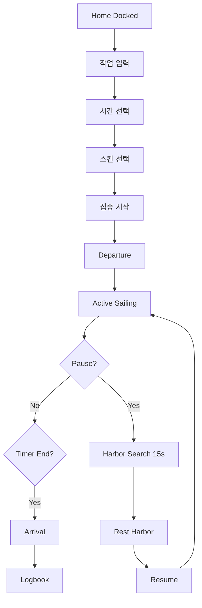

# Quick Focus Flow

```mermaid
flowchart TD
  A[Home Docked] --> B[작업 입력]
  B --> C[시간 선택]
  C --> D[스킨 선택]
  D --> E[집중 시작]
  E --> F[Departure]
  F --> G[Active Sailing]
  G --> H{Pause?}
  H -- No --> I{Timer End?}
  H -- Yes --> J[Harbor Search 15s]
  J --> K[Rest Harbor]
  K --> L[Resume]
  L --> G
  I -- Yes --> M[Arrival]
  M --> N[Logbook]
```
