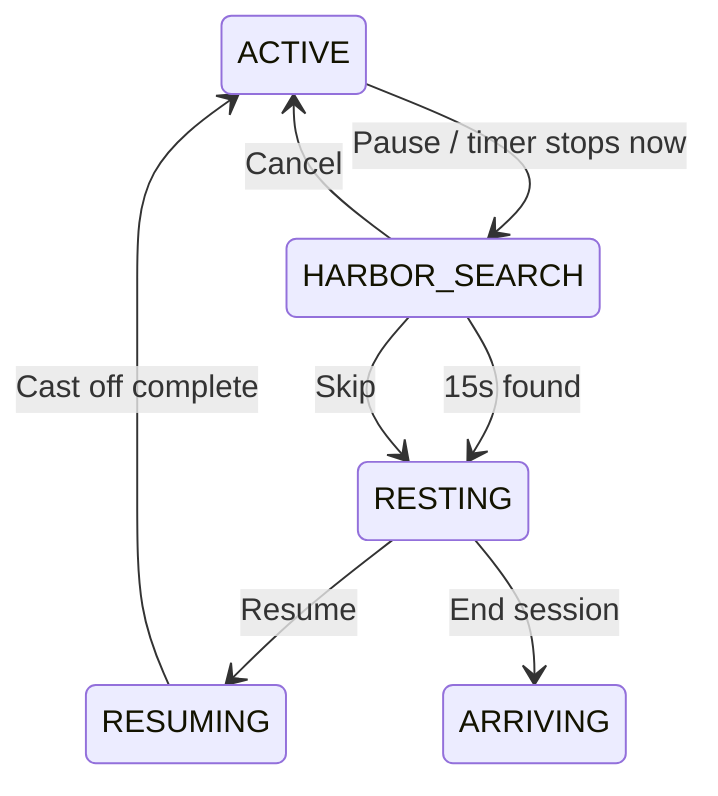

# Pause, Rest, Resume Flow

```mermaid
stateDiagram-v2
  ACTIVE --> HARBOR_SEARCH: Pause / timer stops now
  HARBOR_SEARCH --> RESTING: 15s found
  HARBOR_SEARCH --> RESTING: Skip
  HARBOR_SEARCH --> ACTIVE: Cancel
  RESTING --> RESUMING: Resume
  RESUMING --> ACTIVE: Cast off complete
  RESTING --> ARRIVING: End session
```
