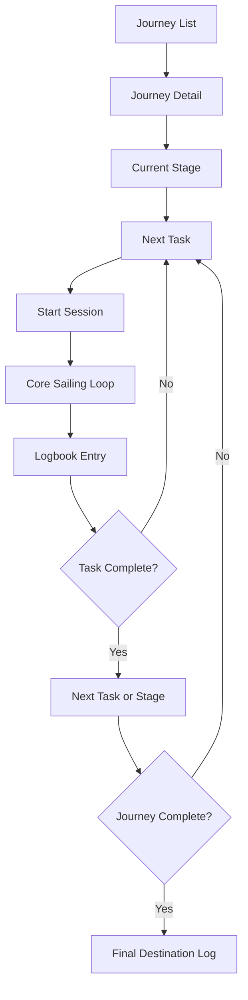

# Long Journey Flow

```mermaid
flowchart TD
  A[Journey List] --> B[Journey Detail]
  B --> C[Current Stage]
  C --> D[Next Task]
  D --> E[Start Session]
  E --> F[Core Sailing Loop]
  F --> G[Logbook Entry]
  G --> H{Task Complete?}
  H -- Yes --> I[Next Task or Stage]
  H -- No --> D
  I --> J{Journey Complete?}
  J -- No --> D
  J -- Yes --> K[Final Destination Log]
```
